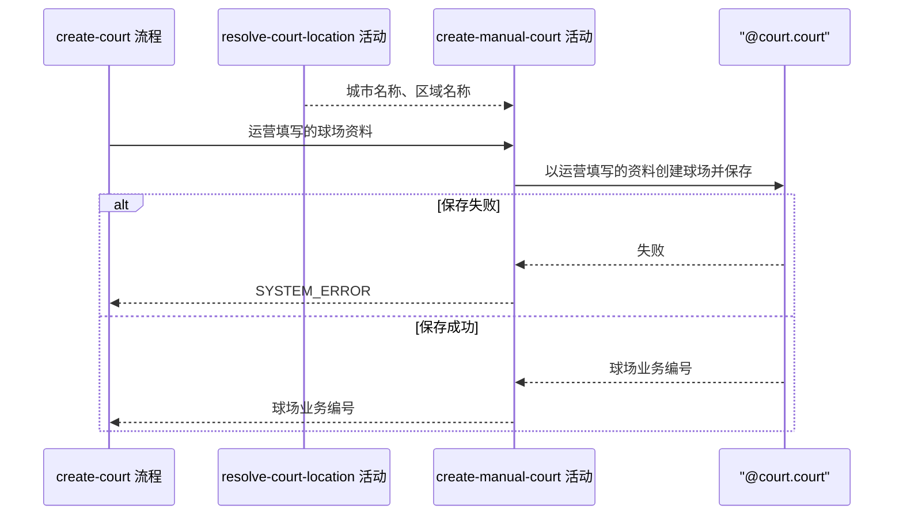

## 概要

写入一条手工录入球场，返回新生成的球场业务编号。

## 时序图

## 触发条件

运营提交球场新增表单、参数格式校验通过、归属信息已解析完毕后执行。执行前该球场在库中不存在。

## 活动契约

### 入参

| 字段 | 类型 | 必填 | 约束 |
|---|---|---|---|
| `name` | 字符串 | 是 | 非空白，最长 128 字符 |
| `cityCode` | 字符串 | 是 | 由 `resolve-court-location` 回传 |
| `cityName` | 字符串 | 是 | 由 `resolve-court-location` 回传 |
| `districtCode` | 字符串 | 否 | 由 `resolve-court-location` 回传 |
| `districtName` | 字符串 | 否 | 由 `resolve-court-location` 回传 |
| `alias` | 字符串列表 | 否 | 连接后最长 128 字符 |
| `address` | 字符串 | 否 | 最长 256 字符 |
| `lng` | 小数 | 否 | -180 到 180 |
| `lat` | 小数 | 否 | -90 到 90 |
| `remark` | 字符串 | 否 | 最长 255 字符 |
| `type` | 枚举 | 否 | `INDOOR` / `OUTDOOR` |
| `surface` | 枚举 | 否 | `HARD` / `CLAY` / `GRASS` |
| `tags` | 字符串列表 | 否 | 连接后最长 512 字符 |
| `rating` | 字符串 | 否 | 评分展示值 |
| `cost` | 字符串 | 否 | 费用展示值 |
| `opentime` | 字符串 | 否 | 开放时间展示值 |
| `tel` | 字符串 | 否 | 联系电话 |
| `status` | 枚举 | 否 | `COLLECTED` / `ACTIVE` / `DISABLED`，不填按 `ACTIVE` |

### 成功返回

| 字段 | 类型 | 必填 | 说明 |
|---|---|---|---|
| `courtId` | 字符串 | 是 | 新增球场的业务编号 |

## 异常分支

| 错误标识 | 触发条件 | 来源 |
|---|---|---|
| `SYSTEM_ERROR` | 球场保存失败 | create-court 流程 `SYSTEM_ERROR` 一行 |

## 领域依赖

### @court.court

- 输入：球场名称、别名、地址、经纬度、城市与区域归属、备注、球场环境、场地材质、标签、评分、费用、开放时间、联系电话、球场状态
- 输出：一个新建成的球场，业务编号已生成，来源为系统录入，三方来源编号为空，约球次数为 0，状态取入参给的值、没给按可用，扩展资料里的拼音与拼音首字母与球场名称一致，别名与标签按英文逗号连接后存放。异常形态：保存失败时把失败原样抛出，不吞掉

## 业务动作

A1 以运营填写的资料与已解析的归属信息创建球场
A2 保存球场
A3 返回新球场的业务编号

## 详细流程

1. `A1` 由球场自身生成业务编号、按名称生成拼音与拼音首字母、把别名与标签连接成串，本活动不代劳。
2. `A1` 不做重名或就近查重，同一处球场可以被反复录入。
3. `A2` 是单条写入，自成一个事务，失败时不产生任何记录，无需补偿。
4. `A3` 只在 `A2` 成功后执行。

## 边界情况

- 别名或标签为空列表：存为空，不写入内容。
- 评分、费用、开放时间、联系电话全部没填：扩展资料里只有拼音两项。
- 库中已有同名或同址球场：不拦截，照常新增一条。
- 状态填 `DISABLED`：合法，录入后即为已停用，不进用户端清单。

## 实现提示

业务编号用项目统一的雪花编号生成方式，不要另起一套。

