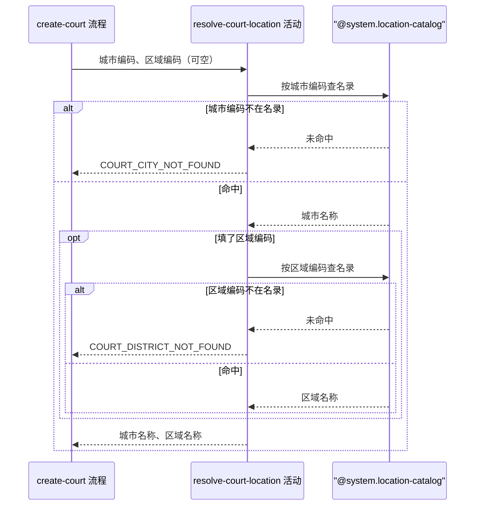

## 概要

校验城市与区域编码在名录中存在，取回对应的中文名称。

## 时序图

## 触发条件

运营提交球场新增表单、参数格式校验通过后，写库之前执行。执行时球场尚未创建。

## 活动契约

### 入参

| 字段 | 类型 | 必填 | 约束 |
|---|---|---|---|
| `cityCode` | 字符串 | 是 | 非空白，六位城市编码 |
| `districtCode` | 字符串 | 否 | 六位区县编码，不填则跳过区域校验 |

### 成功返回

| 字段 | 类型 | 必填 | 说明 |
|---|---|---|---|
| `cityCode` | 字符串 | 是 | 原样回传的城市编码 |
| `cityName` | 字符串 | 是 | 名录中该城市编码对应的中文名称 |
| `districtCode` | 字符串 | 否 | 原样回传的区域编码，入参没填时为空 |
| `districtName` | 字符串 | 否 | 名录中该区域编码对应的中文名称，入参没填时为空 |

## 异常分支

| 错误标识 | 触发条件 | 来源 |
|---|---|---|
| `COURT_CITY_NOT_FOUND` | 城市编码在城市名录中查不到 | create-court 流程 `COURT_CITY_NOT_FOUND` 一行 |
| `COURT_DISTRICT_NOT_FOUND` | 填了区域编码但在区县名录中查不到 | create-court 流程 `COURT_DISTRICT_NOT_FOUND` 一行 |

## 领域依赖

### @system.location-catalog

- 输入：城市编码；区域编码
- 输出：编码命中时给出该编码对应的中文名称。异常形态：编码不在名录中时给出「未命中」的结论，由本活动决定报哪个错误标识，名录本身不报错

## 业务动作

A1 按城市编码查名录，未命中则报 `COURT_CITY_NOT_FOUND`
A2 填了区域编码时按区域编码查名录，未命中则报 `COURT_DISTRICT_NOT_FOUND`
A3 把城市编码、城市名称、区域编码、区域名称组成归属信息返回

## 详细流程

1. `A1` 未命中时立刻报错返回，不进入 `A2`。
2. `A2` 只在入参填了区域编码时执行；没填时跳过，区域编码与区域名称都按空处理。
3. `A2` 不校验区域编码是否属于 `A1` 的那座城市，两者对不上也照常放行。
4. 本活动只读名录，不产生任何状态变更，无事务、无补偿。

## 边界情况

- 只填城市不填区域：合法，区域名称留空。
- 区域编码与城市编码不属于同一座城市：不校验，照常放行。
- 名录本身读取失败：视为编码未命中，报对应的不存在错误。

## 实现提示

城市名录与区县名录都是随包发布的静态资源，进程内一次加载建索引即可，不必每次读文件。

