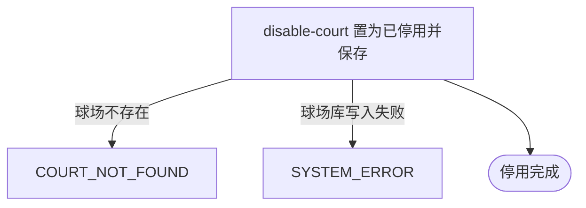

## 概要

运营下架一个球场，使它从用户端球场清单与搜索中消失。

## 触发

运营在后台点「停用」发起，调用方是运营后台，需带运营密钥。一次触发停用一个球场。重复停用同一个球场结果一致，天然幂等。

## 接口契约

### 请求参数

| 字段 | 类型 | 必填 | 约束 |
|---|---|---|---|
| `courtId` | 字符串 | 是 | 非空白，需对应一个已存在的球场 |

### 成功响应

无

## 业务活动

- disable-court  取出球场，把状态置为已停用并保存；已是停用状态时不再改写

## 流程图

## 详细流程

1. 接收球场业务编号。
2. 按业务编号取出该球场。
3. 该球场已是停用状态时，视为已达成终态，直接结束。
4. 把球场状态置为已停用，其余资料保持原值。
5. 保存球场，结束。该球场不再出现在用户端的球场清单与球场搜索中，已引用它的约球与赛事仍能按业务编号查到球场资料。

## 异常分支

| 对外失败码 | 触发条件 | 由哪个活动报出 | 补偿动作或超时处理 | 对外提示 |
|---|---|---|---|---|
| `PARAM_ERROR` | 球场业务编号为空白 | 流程 | 无，未改写 | 参数错误 |
| `COURT_NOT_FOUND` | 球场业务编号对应的球场不存在 | disable-court | 无，未改写 | 球场不存在 |
| `SYSTEM_ERROR` | 球场库写入失败 | disable-court | 无，未改写 | 系统异常，请稍后重试 |

## 技术线索

- 表 `rally_court`，本流程只改写 `status` 为 `DISABLED`
