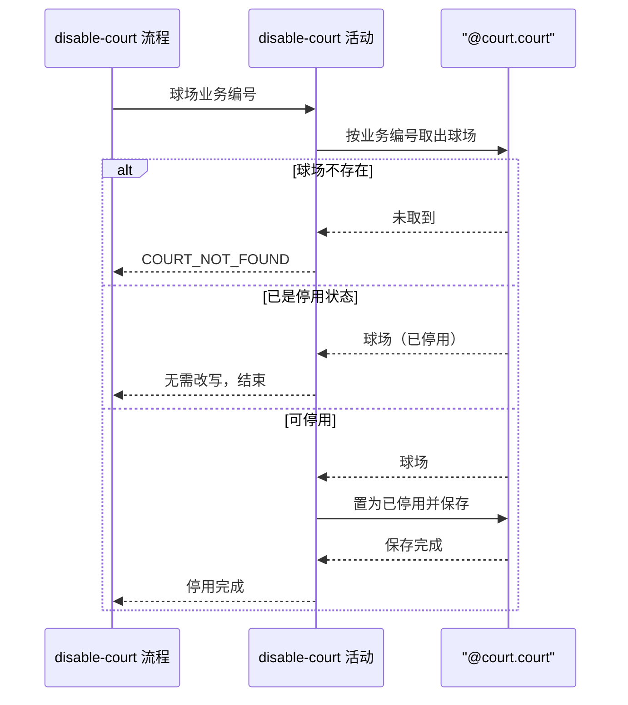

## 概要

把指定球场置为已停用并保存，已停用的不再改写。

## 时序图

## 触发条件

运营在后台对某个球场发起停用，请求已通过运营密钥校验且球场业务编号非空白时执行。执行前球场可以处于已收录、可用或已停用中的任一状态。

## 活动契约

### 入参

| 字段 | 类型 | 必填 | 约束 |
|---|---|---|---|
| `courtId` | 字符串 | 是 | 非空白，球场业务编号 |

### 成功返回

无

## 异常分支

| 错误标识 | 触发条件 | 来源 |
|---|---|---|
| `COURT_NOT_FOUND` | 球场业务编号取不到球场 | disable-court 流程 `COURT_NOT_FOUND` 一行 |
| `SYSTEM_ERROR` | 球场保存失败 | disable-court 流程 `SYSTEM_ERROR` 一行 |

## 领域依赖

### @court.court

- 输入：球场业务编号；停用意图
- 输出：按业务编号取出的球场，含当前状态；停用后球场状态为已停用且其余字段不变。异常形态：业务编号取不到球场时给出「球场不存在」的结论；保存失败时把失败原样抛出，不吞掉

## 业务动作

A1 按球场业务编号取出球场，取不到则报 `COURT_NOT_FOUND`
A2 球场已是停用状态时直接结束，不再改写
A3 把球场状态置为已停用并保存

## 详细流程

1. `A1` 取不到球场时立刻报错返回，不进入 `A2`。
2. `A2` 命中时活动到此结束，视为已达成终态，对外按成功返回。
3. `A3` 只改写状态一个字段，其余字段保持取出时的原值。单次保存即为一个事务，失败时球场保持原状态，无需补偿。

## 边界情况

- 球场业务编号对应的球场已被停用：按幂等处理，不改写、不报错。
- 球场仍被进行中的约球或赛事引用：不校验、不拦截，照常停用。
- 球场状态为已收录（待审核）：同样可以停用，直接置为已停用。

## 实现提示

只改一个状态字段，用按业务编号的条件更新即可，不必读回整条再整体覆盖。
