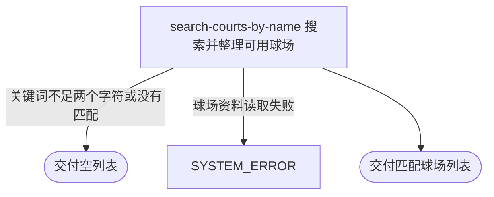

## 概要

按城市和名称关键词为用户或访客交付可用球场。

## 触发

用户或匿名访客输入城市和球场名称关键词发起，调用方是用户端应用，该入口允许无登录凭证访问。一次请求查询一个城市，不分页、不限制数量，也不承诺排序。相同请求重复到达按当前球场资料重新查询，不产生业务状态变化。

## 接口契约

### 请求参数

| 字段 | 类型 | 必填 | 约束 |
|---|---|---|---|
| `cityCode` | 字符串 | 是 | 非空白；不校验是否存在于城市名录 |
| `query` | 字符串 | 否 | 少于 2 个字符时直接返回空列表；两个及以上空白字符会按无名称筛选处理 |

### 成功响应

| 字段 | 类型 | 说明 |
|---|---|---|
| 球场列表 | 对象列表 | 每项包含球场编号、名称、别名、地址、经纬度、城市与区域、环境及环境名称、标签、备注、拼音、评分、费用、开放时间和联系电话；没有结果时为空列表 |

## 业务活动

- search-courts-by-name  在指定城市的可用球场中按正式名称或别名匹配关键词并整理结果

## 流程图

## 详细流程

1. 接收城市编码和名称关键词；城市编码为空白时拒绝搜索。
2. 关键词未填写或长度少于两个字符时，不查询球场并直接交付空列表。
3. 在指定城市的可用球场中，保留正式名称或别名包含关键词的球场；两个及以上空白字符会按无名称筛选处理，从而交付该城市全部可用球场。
4. 把别名和标签拆成列表，补充环境中文名称，并从扩展资料补充拼音、评分、费用、开放时间和联系电话。
5. 交付匹配球场列表；没有匹配项时交付空列表。

## 异常分支

| 对外失败码 | 触发条件 | 由哪个活动报出 | 补偿动作或超时处理 | 对外提示 |
|---|---|---|---|---|
| `PARAM_ERROR` | 城市编码为空或只含空白 | 流程 | 本流程只读，无需补偿 | 请选择城市 |
| `SYSTEM_ERROR` | 请求正文缺失或无法解析、球场枚举无法识别、球场资料读取失败 | search-courts-by-name | 本流程只读，无需补偿 | 系统异常，请稍后重试 |
| 无 | 关键词不足两个字符，或没有匹配球场 | search-courts-by-name | 按成功结果收场 | 空列表 |

## 技术线索

- 表 `rally_court`，按 `city_code`、`status = ACTIVE` 以及 `name` 或 `alias` 范围匹配
