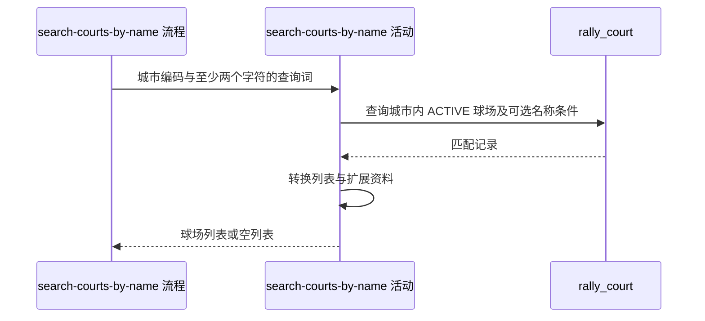

## 概要

按城市及名称或别名关键词搜索可用球场。

## 时序图

## 触发条件

用户或匿名访客提交城市和名称关键词，且流程判断原始关键词不为 `null`、长度至少为 2 后执行。

## 活动契约

### 入参

| 字段 | 类型 | 必填 | 约束 |
|---|---|---|---|
| `cityCode` | 字符串 | 是 | 非空白；不核对城市名录 |
| `query` | 字符串 | 是 | 原始长度至少 2；活动不裁剪 |

### 成功返回

匹配球场对象列表，字段与城市球场清单一致；没有匹配时为空列表。

## 异常分支

| 错误标识 | 触发条件 | 处理 |
|---|---|---|
| `SYSTEM_ERROR` | 资料读取或枚举、扩展资料转换发生不可恢复错误 | 终止只读活动，不返回部分列表 |
| 无 | 没有匹配球场 | 返回空列表 |

## 领域依赖

无

## 业务动作

A1 在指定城市的可用球场中应用名称或别名条件
A2 拆分别名和标签并转换环境展示名
A3 解析扩展资料并组装对外球场列表

## 详细流程

1. 流程按原始字符串长度拦截 `null` 或少于 2 个字符的关键词，直接返回空列表；不先 `trim`。
2. `A1` 查询 `city_code` 精确相等且 `status=ACTIVE` 的记录；关键词非空白时追加 `name LIKE query OR alias LIKE query`。
3. 长度至少 2 但全部为空白的关键词不追加名称条件，因此查询该城市全部可用球场。
4. 查询不分页、不限量、不追加排序；`LIKE` 的大小写和转义行为遵循数据库当前排序规则与绑定方式。
5. `A2-A3` 复用城市清单映射，拆分别名和标签、生成环境展示名，并从 `ext_data` 补充拼音、评分、费用、开放时间和联系电话。

## 边界情况

- 单个中文字符长度为 1，会在流程直接返回空列表。
- 两个空格长度为 2，会返回城市全部可用球场，这是当前既有行为。
- 城市编码不存在或关键词无匹配时返回空列表。
- 数据库不承诺结果顺序；别名、标签或扩展字段缺失不影响球场入选。

## 实现提示

若将来调整关键词归一化，应同时修改流程长度门槛与仓储空白判断；当前活动保持真实兼容行为。
