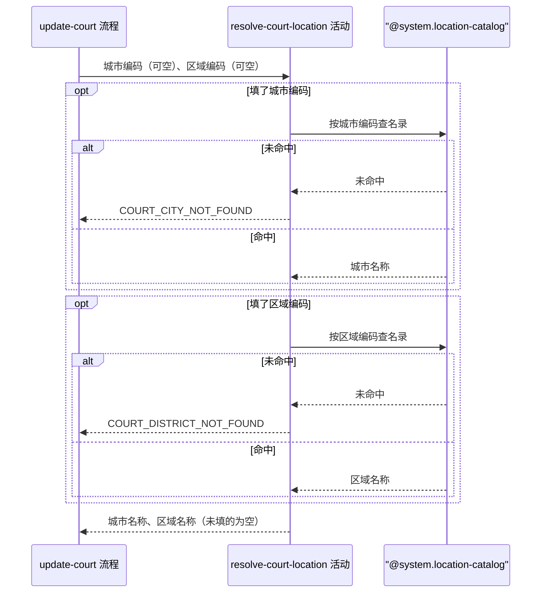

## 概要

运营填了城市或区域编码时校验它在名录中存在，取回中文名称。

## 时序图

## 触发条件

运营提交球场编辑表单、参数格式校验通过后，取出球场改写之前执行。两个编码都没填时本活动不做任何查询，直接返回空归属信息。

## 活动契约

### 入参

| 字段 | 类型 | 必填 | 约束 |
|---|---|---|---|
| `cityCode` | 字符串 | 否 | 六位城市编码，不填表示不改城市 |
| `districtCode` | 字符串 | 否 | 六位区县编码，不填表示不改区域 |

### 成功返回

| 字段 | 类型 | 必填 | 说明 |
|---|---|---|---|
| `cityCode` | 字符串 | 否 | 原样回传的城市编码，入参没填时为空 |
| `cityName` | 字符串 | 否 | 名录中该城市编码对应的中文名称，入参没填时为空 |
| `districtCode` | 字符串 | 否 | 原样回传的区域编码，入参没填时为空 |
| `districtName` | 字符串 | 否 | 名录中该区域编码对应的中文名称，入参没填时为空 |

## 异常分支

| 错误标识 | 触发条件 | 来源 |
|---|---|---|
| `COURT_CITY_NOT_FOUND` | 填了城市编码但在城市名录中查不到 | update-court 流程 `COURT_CITY_NOT_FOUND` 一行 |
| `COURT_DISTRICT_NOT_FOUND` | 填了区域编码但在区县名录中查不到 | update-court 流程 `COURT_DISTRICT_NOT_FOUND` 一行 |

## 领域依赖

### @system.location-catalog

- 输入：城市编码；区域编码
- 输出：编码命中时给出该编码对应的中文名称。异常形态：编码不在名录中时给出「未命中」的结论，由本活动决定报哪个错误标识，名录本身不报错

## 业务动作

A1 填了城市编码时按它查名录，未命中则报 `COURT_CITY_NOT_FOUND`
A2 填了区域编码时按它查名录，未命中则报 `COURT_DISTRICT_NOT_FOUND`
A3 把查到的城市编码、城市名称、区域编码、区域名称组成归属信息返回，没填的项留空

## 详细流程

1. `A1` 未命中时立刻报错返回，不进入 `A2`。
2. `A1` 与 `A2` 各自独立，只改区域不改城市、只改城市不改区域都合法。
3. `A2` 不校验区域编码是否属于本次或球场原有的那座城市，两者对不上也照常放行。
4. 两个编码都没填时 `A1` `A2` 都跳过，`A3` 返回四项全空的归属信息，编排方据此判定不改归属。
5. 本活动只读名录，不产生任何状态变更，无事务、无补偿。

## 边界情况

- 两个编码都没填：不查名录，返回全空，编排方不改球场归属。
- 只改区域不改城市：合法，城市编码与城市名称留空，球场原有城市保持不变。
- 区域编码与球场所属城市不匹配：不校验，照常放行。
- 名录本身读取失败：视为编码未命中，报对应的不存在错误。

## 实现提示

与 `court.court-create.activity.resolve-court-location` 只差在两个编码都可空，实现上可共用同一个名录查询能力，差异留在活动的编排里。
