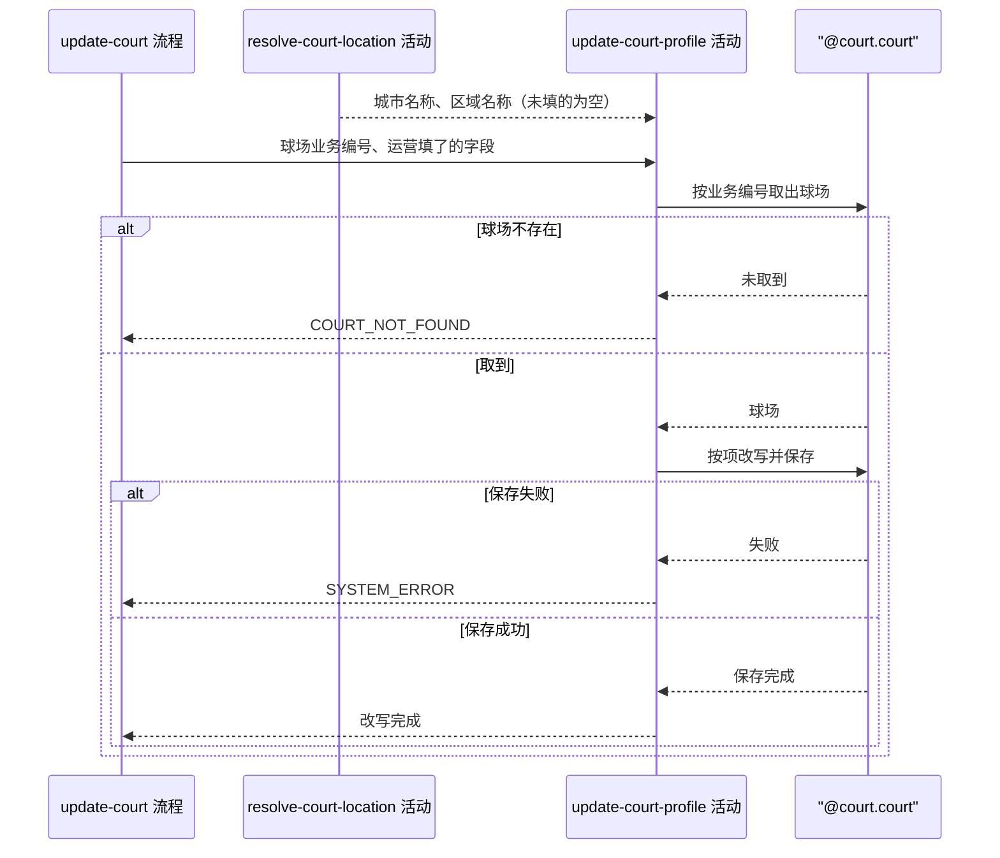

## 概要

取出球场，把运营填了的字段逐项改写并保存。

## 时序图

## 触发条件

运营提交球场编辑表单、参数格式校验通过、归属信息已解析完毕后执行。执行前球场处于已收录、可用或已停用中的任一状态。

## 活动契约

### 入参

| 字段 | 类型 | 必填 | 约束 |
|---|---|---|---|
| `courtId` | 字符串 | 是 | 非空白，球场业务编号 |
| `name` | 字符串 | 否 | 最长 128 字符，不传表示不改 |
| `alias` | 字符串列表 | 否 | 连接后最长 128 字符；空列表表示清空，不传表示不改 |
| `address` | 字符串 | 否 | 最长 256 字符，不传表示不改 |
| `lng` | 小数 | 否 | -180 到 180，不传表示不改 |
| `lat` | 小数 | 否 | -90 到 90，不传表示不改 |
| `remark` | 字符串 | 否 | 最长 255 字符，不传表示不改 |
| `type` | 枚举 | 否 | `INDOOR` / `OUTDOOR`，不传表示不改 |
| `surface` | 枚举 | 否 | `HARD` / `CLAY` / `GRASS`，不传表示不改 |
| `tags` | 字符串列表 | 否 | 连接后最长 512 字符；空列表表示清空，不传表示不改 |
| `rating` | 字符串 | 否 | 评分展示值，不传表示不改 |
| `cost` | 字符串 | 否 | 费用展示值，不传表示不改 |
| `opentime` | 字符串 | 否 | 开放时间展示值，不传表示不改 |
| `tel` | 字符串 | 否 | 联系电话，不传表示不改 |
| `status` | 枚举 | 否 | `COLLECTED` / `ACTIVE` / `DISABLED`，不传表示不改 |
| `cityCode` | 字符串 | 否 | 由 `resolve-court-location` 回传，不传表示不改城市 |
| `cityName` | 字符串 | 否 | 由 `resolve-court-location` 回传，随 `cityCode` 一起改 |
| `districtCode` | 字符串 | 否 | 由 `resolve-court-location` 回传，不传表示不改区域 |
| `districtName` | 字符串 | 否 | 由 `resolve-court-location` 回传，随 `districtCode` 一起改 |

### 成功返回

无

## 异常分支

| 错误标识 | 触发条件 | 来源 |
|---|---|---|
| `COURT_NOT_FOUND` | 球场业务编号取不到球场 | update-court 流程 `COURT_NOT_FOUND` 一行 |
| `SYSTEM_ERROR` | 球场保存失败 | update-court 流程 `SYSTEM_ERROR` 一行 |

## 领域依赖

### @court.court

- 输入：球场业务编号；一组「填了才改」的球场字段，其中别名与标签区分「空列表清空」与「不传不改」；扩展资料中的评分、费用、开放时间、联系电话同样逐项判定
- 输出：按业务编号取出的球场；改写后球场只有填了的字段发生变化，其余字段保持原值，球场名称被改写时扩展资料里的拼音与拼音首字母随之与新名称一致，球场业务编号、三方来源编号、来源与约球次数始终不变。异常形态：业务编号取不到球场时给出「球场不存在」的结论；保存失败时把失败原样抛出，不吞掉

## 业务动作

A1 按球场业务编号取出球场，取不到则报 `COURT_NOT_FOUND`
A2 把运营填了的球场字段逐项改写到球场上，没填的保持原值
A3 把归属信息中填了的城市编码与名称、区域编码与名称改写到球场上
A4 把扩展资料中填了的评分、费用、开放时间、联系电话逐项改写，其余项保持原值
A5 保存球场

## 详细流程

1. `A1` 取不到球场时立刻报错返回，不进入后续动作。
2. `A2` 中别名与标签按列表判定：传了空列表就清空为无，不传就保持原值；其余字段不传即不改。
3. `A2` 改写了球场名称时，扩展资料里的拼音与拼音首字母由球场自身保证与新名称一致，本活动不单独计算。
4. `A3` 的城市与区域各自独立，只改其一时另一项保持原值。
5. `A4` 只动扩展资料里的四个展示项，拼音两项不在此列。
6. `A2` 到 `A5` 在同一个事务内，`A5` 失败时全部改写不生效，球场保持原样，无需补偿。
7. 除球场业务编号外一项都没填时，`A2` 到 `A4` 都不产生变化，`A5` 仍然执行一次保存，结果与原值相同。

## 边界情况

- 除球场业务编号外一项都没填：不报错，按无变化处理。
- 别名或标签传空列表：清空为无，与不传区分开。
- 球场原本没有扩展资料：只写入本次填了的展示项，其余项不出现。
- 改写后的城市编码与球场坐标不一致：不校验，照常保存。
- 两个运营同时改同一个球场：不做版本校验，后保存的覆盖先保存的。

## 实现提示

「填了才改」的判定靠入参对象的字段是否为 null，别名与标签用空列表与 null 区分清空和不改，因此这两个字段在入参对象上要保留 null 语义，不要在反序列化阶段被默认成空列表。
