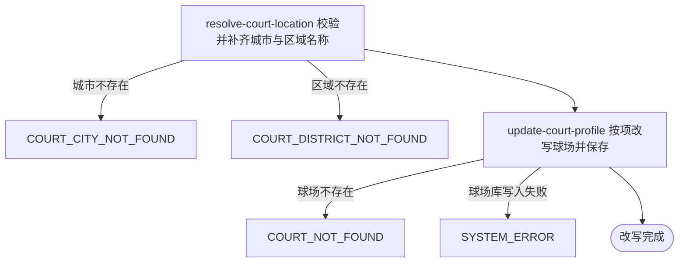

## 概要

运营按项改写一个已收录球场的资料，即改即对用户生效。

## 触发

运营在后台改完球场表单后提交，调用方是运营后台，需带运营密钥。一次触发改写一个球场。同一份表单重复提交结果一致，天然幂等；不做并发控制，两个运营同时改同一个球场时后写的覆盖先写的。

## 接口契约

### 请求参数

| 字段 | 类型 | 必填 | 约束 |
|---|---|---|---|
| `courtId` | 字符串 | 是 | 非空白，需对应一个已存在的球场 |
| `name` | 字符串 | 否 | 最长 128 字符，不传则不改 |
| `cityCode` | 字符串 | 否 | 需存在于平台城市名录，不传则不改 |
| `alias` | 字符串列表 | 否 | 以英文逗号连接后最长 128 字符；传空列表表示清空，不传则不改 |
| `address` | 字符串 | 否 | 最长 256 字符，不传则不改 |
| `lng` | 小数 | 否 | -180 到 180，不传则不改 |
| `lat` | 小数 | 否 | -90 到 90，不传则不改 |
| `districtCode` | 字符串 | 否 | 需存在于平台区县名录，不传则不改 |
| `remark` | 字符串 | 否 | 最长 255 字符，不传则不改 |
| `type` | 枚举 | 否 | `INDOOR` / `OUTDOOR`，不传则不改 |
| `surface` | 枚举 | 否 | `HARD` / `CLAY` / `GRASS`，不传则不改 |
| `tags` | 字符串列表 | 否 | 以英文逗号连接后最长 512 字符；传空列表表示清空，不传则不改 |
| `rating` | 字符串 | 否 | 评分展示值，不传则不改 |
| `cost` | 字符串 | 否 | 费用展示值，不传则不改 |
| `opentime` | 字符串 | 否 | 开放时间展示值，不传则不改 |
| `tel` | 字符串 | 否 | 联系电话，不传则不改 |
| `status` | 枚举 | 否 | `COLLECTED` / `ACTIVE` / `DISABLED`，不传则不改 |

### 成功响应

无

## 业务活动

- resolve-court-location  运营填了城市编码或区域编码时，校验它在名录中存在并取得对应的城市名称与区域名称
- update-court-profile  取出球场，把运营填了的字段逐项改写到球场上并保存，没填的保持原值

## 流程图

## 详细流程

1. 接收球场业务编号与运营填了的字段。
2. 填了城市编码时，在城市名录中确认存在并取得新的城市名称；填了区域编码时，在区县名录中确认存在并取得新的区域名称。
3. 按业务编号取出该球场。
4. 填了球场名称时，按新名称重新生成拼音与拼音首字母。
5. 把运营填了的字段逐项改写到该球场，没填的保持原值；别名与标签传了空列表时清空，不传时保持原值；扩展资料中填了的展示项逐项改写，其余项保持原值。
6. 保存球场，结束。除球场业务编号外一项都没填时，视为无需改写，直接结束。

## 异常分支

| 对外失败码 | 触发条件 | 由哪个活动报出 | 补偿动作或超时处理 | 对外提示 |
|---|---|---|---|---|
| `PARAM_ERROR` | 球场业务编号为空白；球场环境、场地材质、球场状态不是允许的取值；经纬度超出取值范围；名称、别名、地址、备注、标签超出长度上限 | 流程 | 无，未改写 | 参数错误 |
| `COURT_CITY_NOT_FOUND` | 城市编码在城市名录中不存在 | resolve-court-location | 无，未改写 | 城市不存在 |
| `COURT_DISTRICT_NOT_FOUND` | 区域编码在区县名录中不存在 | resolve-court-location | 无，未改写 | 区域不存在 |
| `COURT_NOT_FOUND` | 球场业务编号对应的球场不存在 | update-court-profile | 无，未改写 | 球场不存在 |
| `SYSTEM_ERROR` | 球场库写入失败 | update-court-profile | 无，未改写 | 系统异常，请稍后重试 |

## 技术线索

- 表 `rally_court`，本流程可改写 `name`、`alias`、`address`、`lng`、`lat`、`city_code`、`district_code`、`city_name`、`district_name`、`remark`、`type`、`surface`、`tags`、`ext_data`、`status`
- 不改写 `biz_id`、`source_id`、`source`、`meetup_count`
- 城市名录 `city.json`，区县名录 `district.json`
