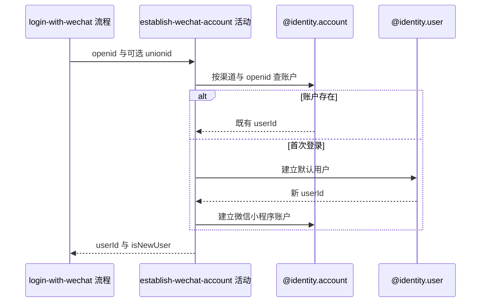

## 概要

识别微信账户，不存在时建立默认用户与账户。

## 时序图

## 触发条件

微信身份核实成功并取得非空 `openid` 后执行。

## 活动契约

### 入参

| 字段 | 类型 | 必填 | 约束 |
|---|---|---|---|
| `openid` | 字符串 | 是 | 微信小程序账户标识 |
| `unionid` | 字符串 | 否 | 微信可能返回的跨应用标识 |

### 成功返回

| 字段 | 类型 | 必填 | 说明 |
|---|---|---|---|
| `userId` | 字符串 | 是 | 既有或新建用户编号 |
| `isNewUser` | 布尔值 | 是 | 仅本次新建用户和账户时为 true |

## 异常分支

| 错误标识 | 触发条件 | 处理 |
|---|---|---|
| `SYSTEM_ERROR` | 账户查询、用户建立或账户建立失败 | 终止登录；已完成写入不保证撤销 |

## 领域依赖

### @identity.account

- 输入：按 `WECHAT_MINIAPP` 与 `openid` 查询，或关联用户、openid 与可选 unionid 的建户意图
- 输出：既有账户 userId，或唯一的新微信账户。异常形态：查询、唯一冲突或保存失败返回 `SYSTEM_ERROR`

### @identity.user

- 输入：默认昵称“球员”、默认头像及建立用户意图
- 输出：具有新 userId、默认未公开性别的用户。异常形态：保存失败返回 `SYSTEM_ERROR`

## 业务动作

A1 按微信小程序渠道与 openid 查找账户
A2 未命中时建立默认用户
A3 为新用户建立微信小程序账户
A4 返回用户编号和本次新建标识

## 详细流程

1. `A1` 仅用渠道 `WECHAT_MINIAPP` 与 `identifier=openid` 查询；命中时沿用 `userId` 并返回 `isNewUser=false`。
2. 既有账户不回查用户资料、不更新 `unionId`，也不根据资料完整性改变新用户标识。
3. `A2` 未命中时先建立默认昵称“球员”、默认头像的用户，性别采用 `UNDISCLOSED` 默认值。
4. `A3` 再建立关联该 `userId` 的微信小程序账户，保存 `openid` 与可空 `unionid`，凭证为空；渠道与标识组合保持唯一。
5. 两次写入没有活动级总事务；完成后返回 `isNewUser=true`。

## 边界情况

- 并发首次登录可能都先查不到账户，后完成者命中唯一约束并报错，当前不自动回查重试。
- 用户创建成功但账户创建失败时可能留下未关联用户。
- 已有账户即使对应用户资料缺失也仍按非新用户处理。

## 实现提示

保持账户识别键集中；若治理并发首登，应在领域层引入原子建户或唯一冲突回查，不在活动中吞掉未知写入异常。
