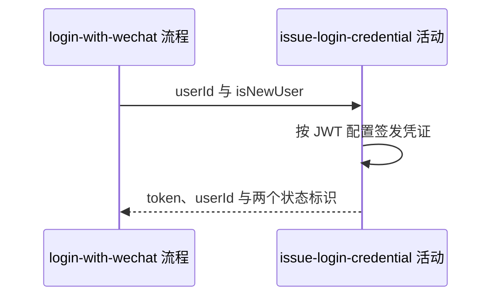

## 概要

为用户签发 JWT 并组装微信登录结果。

## 时序图

## 触发条件

账户识别或建立成功并取得用户编号后执行。

## 活动契约

### 入参

| 字段 | 类型 | 必填 | 约束 |
|---|---|---|---|
| `userId` | 字符串 | 是 | 已关联账户的系统用户编号 |
| `isNewUser` | 布尔值 | 是 | 上游本次建户结果 |

### 成功返回

| 字段 | 类型 | 必填 | 说明 |
|---|---|---|---|
| `token` | 字符串 | 是 | 本次新签发 JWT |
| `userId` | 字符串 | 是 | JWT subject 对应用户编号 |
| `isNewUser` | 布尔值 | 是 | 透传上游标识 |
| `needCompleteInfo` | 布尔值 | 是 | 当前严格等于 `isNewUser` |

## 异常分支

| 错误标识 | 触发条件 | 处理 |
|---|---|---|
| `SYSTEM_ERROR` | JWT 配置无效、密钥不可用或签发失败 | 不返回登录结果；上游已经建立的账户不撤销 |

## 领域依赖

无

## 业务动作

A1 读取 JWT 密钥和有效天数配置
A2 以用户编号为主体签发新 JWT
A3 组装登录凭证与新用户状态

## 详细流程

1. `A1` 读取 `auth.jwt.secret` 和 `auth.jwt.expireDays`，用密钥字节构造 HMAC 签名密钥。
2. `A2` JWT 的 `subject=userId`，`issuedAt` 为当前时间，`expiration` 为当前时间加配置天数，并完成签名。
3. 每次登录都签发新 token，不复用旧 token、不写会话表，也不主动吊销仍有效的旧 token。
4. `A3` 返回 token、userId 和 isNewUser，并令 `needCompleteInfo=isNewUser`；不检查资料实际完整度。

## 边界情况

- 密钥为空或长度不满足签名算法要求时按 `SYSTEM_ERROR`。
- 新账户建立后签发失败不会回滚用户或账户。
- 同一用户快速重复登录可同时持有多个尚未过期的 token。

## 实现提示

签发日志不得输出密钥或完整 token；若未来改变资料完善判断，应拆离 `isNewUser` 而不是改变 JWT 语义。
