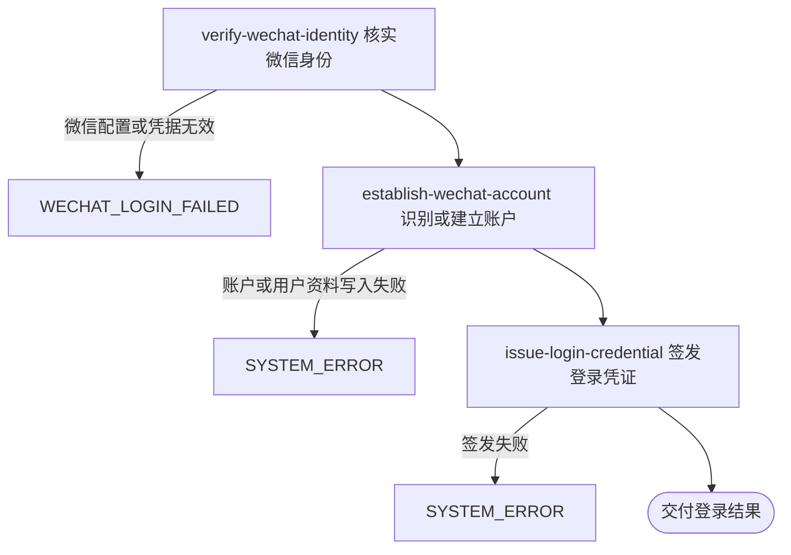

## 概要

核实微信小程序身份，识别或建立账户并交付登录凭证。

## 触发

微信小程序访问者取得临时登录凭据后发起，调用方是微信小程序。一次请求核实一个临时凭据并同步交付一个登录结果。相同微信身份重复登录会复用既有账户和用户编号，但每次重新签发登录凭证；并发首次登录依赖账户唯一约束，当前没有业务重试或孤立用户收场。

## 接口契约

### 请求参数

| 字段 | 类型 | 必填 | 约束 |
|---|---|---|---|
| `code` | 字符串 | 是 | 非空白的微信小程序临时登录凭据 |

### 成功响应

| 字段 | 类型 | 说明 |
|---|---|---|
| `token` | 字符串 | 本次签发的登录凭证 |
| `userId` | 字符串 | 已识别或新建账户关联的用户编号 |
| `isNewUser` | 布尔值 | 本次是否新建用户资料与微信小程序账户 |
| `needCompleteInfo` | 布尔值 | 当前与 `isNewUser` 相同，表示是否进入注册资料完善 |

## 业务活动

- verify-wechat-identity  用临时登录凭据向微信核实访问者身份并取得微信身份标识
- establish-wechat-account  按微信身份识别账户；不存在时建立默认用户资料与微信小程序账户
- issue-login-credential  为账户关联用户签发登录凭证并组成登录结果

## 流程图

## 详细流程

1. 接收微信临时登录凭据；为空白时不调用微信并拒绝登录。
2. 调用微信核实临时凭据，取得小程序范围内的微信身份标识，以及微信可能返回的跨应用标识。
3. 按微信小程序渠道与微信身份标识查找账户。
4. 账户已存在时沿用其用户编号，并把本次标记为非新用户。
5. 账户不存在时，先建立默认昵称“球员”、默认头像和未公开性别的用户资料，再建立关联该用户、保存微信身份标识的微信小程序账户，并把本次标记为新用户。
6. 为已识别的用户编号签发登录凭证，交付凭证、用户编号、新用户标识和资料完善标识；资料完善标识与新用户标识保持一致。

## 异常分支

| 对外失败码 | 触发条件 | 由哪个活动报出 | 补偿动作或超时处理 | 对外提示 |
|---|---|---|---|---|
| `AUTH_CODE_REQUIRED` | 微信临时登录凭据为空白 | 流程 | 未调用微信，未修改账户与用户资料 | code 不能为空 |
| `WECHAT_LOGIN_FAILED` | 微信配置缺失、微信返回失败或没有返回有效身份标识 | verify-wechat-identity | 未修改账户与用户资料；访问者可重新取得临时凭据后重试 | 微信配置错误，或微信 code 无效及微信返回原因 |
| `SYSTEM_ERROR` | 账户读取、用户资料建立、账户建立或登录凭证签发失败 | establish-wechat-account / issue-login-credential | 已完成步骤不保证撤销；用户已建而账户失败时可能留下未关联用户资料 | 系统异常，请稍后重试 |

## 技术线索

- 表 `account`，以微信小程序渠道与 `identifier` 识别账户，保存 `union_id`
- 表 `user`，首次登录建立默认昵称和默认头像
- 外部系统：微信小程序登录凭据核实
