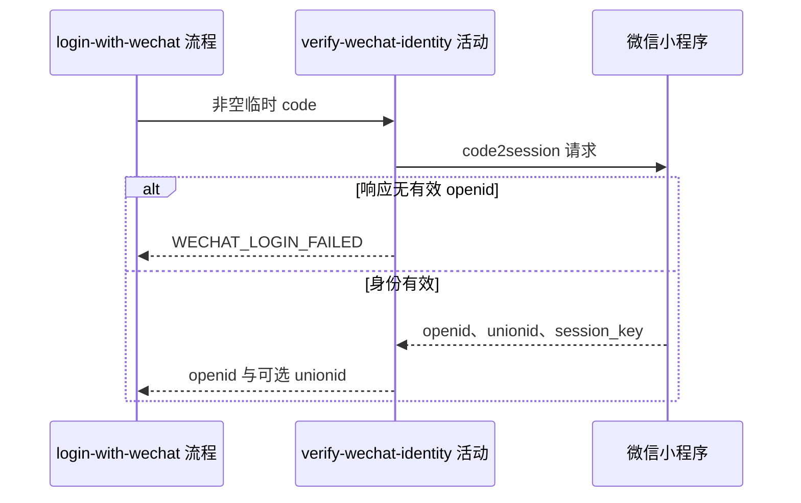

## 概要

向微信核实临时凭据并取得小程序身份。

## 时序图

## 触发条件

流程确认 `code` 非空白后执行；配置缺失时不向微信发出请求。

## 活动契约

### 入参

| 字段 | 类型 | 必填 | 约束 |
|---|---|---|---|
| `code` | 字符串 | 是 | 微信小程序临时登录凭据，已由流程校验非空白 |

### 成功返回

| 字段 | 类型 | 必填 | 说明 |
|---|---|---|---|
| `openid` | 字符串 | 是 | 小程序范围内身份标识 |
| `unionid` | 字符串 | 否 | 微信返回的跨应用身份标识 |

## 异常分支

| 错误标识 | 触发条件 | 处理 |
|---|---|---|
| `WECHAT_LOGIN_FAILED` | code2session URL 缺失、微信请求失败、响应为空、错误码非 0 或 openid 为空 | 不建立账户，调用方重新取得 code 后可重试 |

## 领域依赖

无

## 业务动作

A1 检查微信 code2session 配置
A2 携带应用凭据和临时 code 请求微信
A3 校验响应并输出微信身份标识

## 详细流程

1. `A1` 检查 `wechat.miniapp.code2session-url` 非空；缺失时报 `WECHAT_LOGIN_FAILED`。
2. `A2` 以 GET 请求配置 URL，传入 `appid`、`secret`、`js_code` 与 `grant_type=authorization_code`。
3. `A3` 要求响应非空、`errcode=0` 且 `openid` 非空；否则记录错误线索并报 `WECHAT_LOGIN_FAILED`。
4. 成功只向下游交付 `openid` 与可空 `unionid`；解析到的 `session_key` 不持久化、不对外返回。

## 边界情况

- 空白 code 在流程层以 `AUTH_CODE_REQUIRED` 拒绝，不进入本活动。
- 微信成功响应没有 `unionid` 仍可登录。
- 微信 HTTP、解析或超时异常均不产生本地业务状态。

## 实现提示

微信 RPC snapshot 当前缺失；敏感参数和 `session_key` 不写日志，失败日志仅保留错误码与消息线索。
