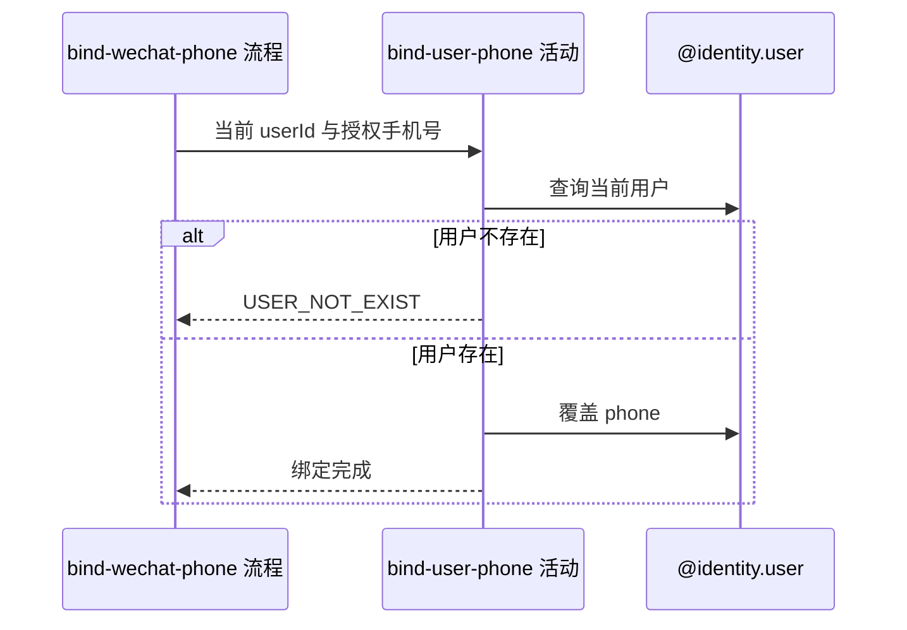

## 概要

以微信授权手机号覆盖当前用户手机号。

## 时序图

## 触发条件

微信手机号解析成功且登录上下文提供当前用户编号后执行。

## 活动契约

### 入参

| 字段 | 类型 | 必填 | 约束 |
|---|---|---|---|
| `userId` | 字符串 | 是 | 来自已验证登录上下文 |
| `phoneNumber` | 字符串 | 是 | 非空微信授权手机号 |

### 成功返回

无业务数据，不回传手机号详情。

## 异常分支

| 错误标识 | 触发条件 | 处理 |
|---|---|---|
| `PARAM_ERROR` | 授权手机号为空 | 不修改用户 |
| `USER_NOT_EXIST` | 当前 userId 没有用户资料 | 不创建新用户 |
| `SYSTEM_ERROR` | 用户查询或更新失败 | 事务回滚，本次手机号覆盖不成立 |

## 领域依赖

### @identity.user

- 输入：当前用户编号、非空授权手机号及覆盖手机号的意图
- 输出：用户 `phone` 更新为本次授权值；用户不存在返回 `USER_NOT_EXIST`。异常形态：保存失败返回 `SYSTEM_ERROR` 并回滚

## 业务动作

A1 校验手机号并取得当前用户资料
A2 覆盖用户手机号并保存
A3 确认绑定完成

## 详细流程

1. `A1` 要求手机号非空，按登录上下文 `userId` 查询用户；不存在时报 `USER_NOT_EXIST`。
2. `A2` 不比较旧值，不检查其他用户、号码唯一性或归属，也不要求二次确认，直接覆盖 `user.phone`。
3. 查询与更新在同一领域事务内；保存失败回滚本次更新并报 `SYSTEM_ERROR`。
4. `A3` 成功只确认完成，不向响应返回手机号。

## 边界情况

- 已绑定相同手机号时仍可幂等覆盖。
- 同一手机号可按当前表约束绑定给多个用户。
- 并发覆盖同一用户时最终值取决于最后完成的更新。

## 实现提示

仅通过 `@identity.user` 修改手机号；活动 `reads` 保持为空，因为它是状态变更活动。
