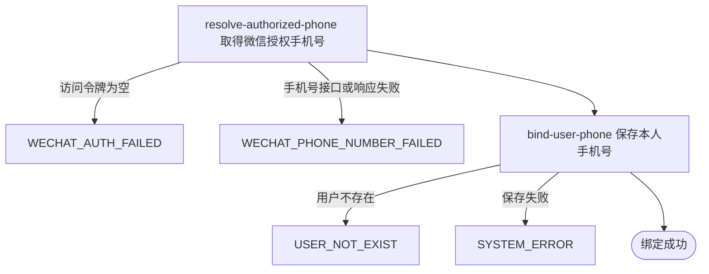

## 概要

将微信授权手机号绑定到当前登录用户资料。

## 触发

已登录用户在微信小程序完成手机号授权后发起，调用方是微信小程序。一次请求只消费一个微信手机号动态令牌并更新本人手机号。已有手机号时直接覆盖，不做重复手机号校验、二次确认或频率限制；重复使用动态令牌能否再次成功由微信决定。

## 接口契约

### 请求参数

| 字段 | 类型 | 必填 | 约束 |
|---|---|---|---|
| `code` | 字符串 | 是 | 非空白的微信手机号动态令牌 |

### 成功响应

无

## 业务活动

- resolve-authorized-phone  用动态令牌向微信取得本次授权手机号
- bind-user-phone  找到当前用户资料并用授权手机号覆盖现有手机号

## 流程图

## 详细流程

1. 识别当前登录用户并接收微信手机号动态令牌；未登录、登录凭证无效或动态令牌为空时拒绝绑定。
2. 使用动态令牌向微信请求本次授权手机号；微信访问授权、手机号授权或有效手机号取得失败时终止。
3. 按当前用户编号取得本人用户资料；用户资料不存在时不创建新用户或账户。
4. 用本次授权手机号覆盖用户资料中的原手机号并保存；不检查该手机号是否已被其他用户使用。
5. 保存成功后向用户确认绑定完成，不返回手机号详情。

## 异常分支

| 对外失败码 | 触发条件 | 由哪个活动报出 | 补偿动作或超时处理 | 对外提示 |
|---|---|---|---|---|
| `UNAUTHORIZED` | 未携带登录凭证或登录凭证无效 | 流程 | 手机号保持原值 | 登录已过期或登录凭证无效，请重新登录 |
| `PARAM_ERROR` | 微信手机号动态令牌为空 | 流程 | 手机号保持原值 | 微信手机号动态令牌不能为空或参数错误 |
| `WECHAT_AUTH_FAILED` | 微信访问令牌为空 | resolve-authorized-phone | 手机号保持原值，用户可重新登录或稍后重试 | 微信授权失败 |
| `WECHAT_PHONE_NUMBER_FAILED` | 手机号授权接口配置缺失、微信返回失败或无有效手机号 | resolve-authorized-phone | 手机号保持原值，用户可重新授权后重试 | 获取微信手机号失败 |
| `USER_NOT_EXIST` | 当前登录身份对应的用户资料不存在 | bind-user-phone | 不创建用户或账户，不保存手机号 | 用户不存在 |
| `SYSTEM_ERROR` | 保存用户资料失败 | bind-user-phone | 事务回滚，本次手机号不成立，原值保持不变 | 系统异常，请稍后重试 |

## 技术线索

- 表 `user`，只改写当前用户的 `phone`
- 外部系统：微信小程序手机号授权
