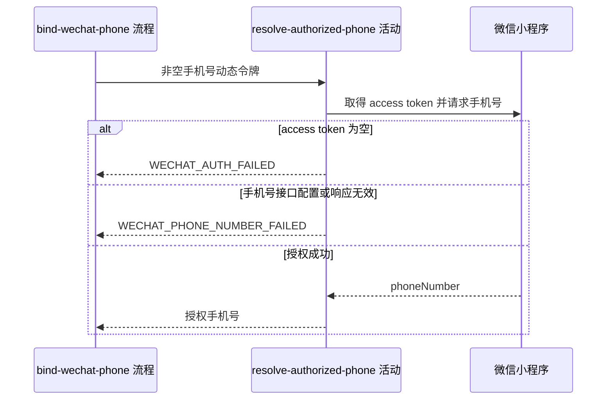

## 概要

用微信动态令牌取得本次授权手机号。

## 时序图

## 触发条件

已登录用户提交的动态令牌通过非空白校验后执行。

## 活动契约

### 入参

| 字段 | 类型 | 必填 | 约束 |
|---|---|---|---|
| `code` | 字符串 | 是 | 微信手机号动态令牌，已由流程校验非空白 |

### 成功返回

| 字段 | 类型 | 必填 | 说明 |
|---|---|---|---|
| `phoneNumber` | 字符串 | 是 | 微信确认的本次授权手机号 |

## 异常分支

| 错误标识 | 触发条件 | 处理 |
|---|---|---|
| `WECHAT_AUTH_FAILED` | 微信访问令牌为空 | 不调用手机号接口，不修改用户 |
| `WECHAT_PHONE_NUMBER_FAILED` | 手机号接口配置缺失、微信响应失败或有效手机号缺失 | 不修改用户，调用方可重新授权后重试 |

## 领域依赖

无

## 业务动作

A1 校验手机号接口配置并取得微信访问令牌
A2 携带动态令牌请求微信手机号接口
A3 校验响应并输出授权手机号

## 详细流程

1. `A1` 要求手机号接口 URL 非空，并通过微信访问令牌客户端取得非空 `access_token`；访问令牌为空报 `WECHAT_AUTH_FAILED`，手机号接口配置缺失报 `WECHAT_PHONE_NUMBER_FAILED`。
2. `A2` 在接口 URL 后携带 `access_token` 查询参数，以 JSON `{"code": code}` 发起 POST。
3. `A3` 要求响应非空、`errcode=0`、`phone_info` 非空且 `phoneNumber` 非空，否则报 `WECHAT_PHONE_NUMBER_FAILED`。
4. 成功只向下游输出 `phoneNumber`，不回传或绑定其他微信手机号字段。

## 边界情况

- 空白 code 在流程层报 `PARAM_ERROR`，不进入活动。
- access token 为空时不调用手机号接口。
- 动态令牌能否重复消费完全遵循微信响应，活动不缓存结果。

## 实现提示

微信 RPC snapshot 当前缺失；请求应标记敏感信息，日志不得输出动态令牌、访问令牌或完整手机号。
