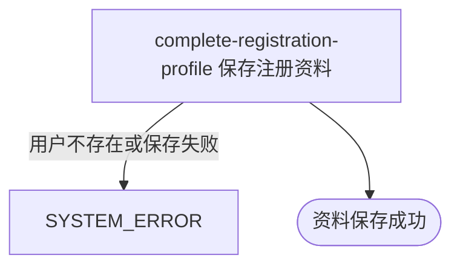

## 概要

保存当前用户的注册资料，使其可被识别为资料已完善。

## 触发

已登录用户提交注册资料时发起，调用方是用户端应用。一次请求只更新当前登录用户，不校验其是否为新用户；已完善用户可重复提交并覆盖资料。相同内容重复提交结果一致，但没有版本或并发控制，后写请求覆盖先写请求。

## 接口契约

### 请求参数

| 字段 | 类型 | 必填 | 约束 |
|---|---|---|---|
| `nickname` | 字符串 | 是 | 非空白 |
| `avatarUrl` | 字符串 | 是 | 非空白 |
| `birthday` | 日期时间 | 否 | 格式 `yyyy-MM-dd HH:mm:ss`，保存时只保留日期 |
| `gender` | 枚举 | 否 | 男性、女性或未公开 |
| `cityCode` | 字符串 | 否 | 不校验城市名录；提交空字符串可覆盖原值 |

### 成功响应

无

## 业务活动

- complete-registration-profile  按当前登录用户保存昵称、头像及已提交的性别、生日和城市资料

## 流程图

## 详细流程

1. 识别当前登录用户并接收注册资料；未登录、登录凭证无效、昵称或头像为空白时拒绝处理。
2. 将请求中的昵称、头像、性别、生日和城市转换为当前用户的注册资料；生日只保留日期部分。
3. 以当前登录用户编号定位用户资料；不存在时不创建新用户。
4. 保存新的昵称与头像，并更新本次提交的可选资料；未提交的可选资料保持原值。
5. 保存成功后确认完成，不返回更新后的资料。系统没有独立注册状态，其他业务仍按昵称与头像是否为默认占位值判断资料是否完善。

## 异常分支

| 对外失败码 | 触发条件 | 由哪个活动报出 | 补偿动作或超时处理 | 对外提示 |
|---|---|---|---|---|
| `UNAUTHORIZED` | 未携带登录凭证或凭证无效 | 流程 | 不写入资料 | 登录已过期或登录凭证无效，请重新登录 |
| `PARAM_ERROR` | 昵称或头像为空白 | 流程 | 不写入资料 | 昵称不能为空或头像不能为空 |
| `SYSTEM_ERROR` | 性别、生日或请求无法解析，当前用户资料不存在，或资料保存失败 | complete-registration-profile | 单条资料未完成更新时保留原值 | 系统异常，请稍后重试 |
| 无 | 昵称或头像仍提交系统默认占位值，或保存操作未实际命中但未报错 | complete-registration-profile | 按成功返回；其他业务仍可能判定资料未完善 | 无 |

## 技术线索

- 表 `user`，更新 `nickname`、`avatar_url`、`gender`、`birthday`、`city_code`
