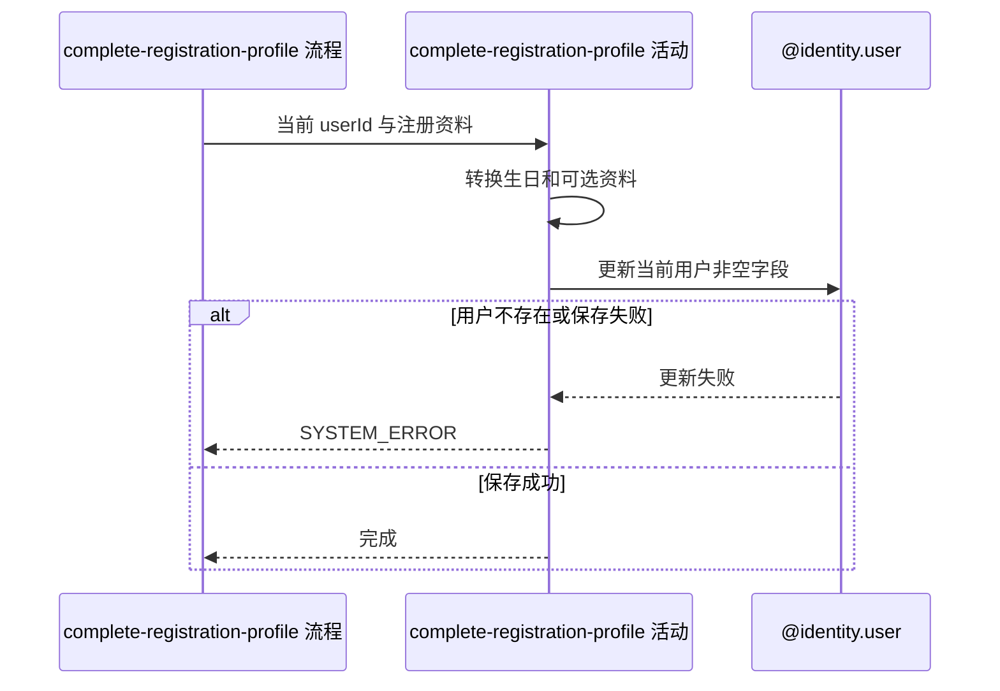

## 概要

保存当前用户提交的注册资料字段。

## 时序图

## 触发条件

已登录用户提交注册资料，且流程已校验昵称与头像非空白后执行；不要求用户处于首次注册状态。

## 活动契约

### 入参

| 字段 | 类型 | 必填 | 约束 |
|---|---|---|---|
| `userId` | 字符串 | 是 | 来自已验证登录上下文 |
| `nickname` | 字符串 | 是 | 非空白 |
| `avatarUrl` | 字符串 | 是 | 非空白 |
| `birthday` | 日期时间 | 否 | 输入格式 `yyyy-MM-dd HH:mm:ss`，保存时只保留日期 |
| `gender` | 枚举 | 否 | 男性、女性或未公开 |
| `cityCode` | 字符串 | 否 | 不核对城市名录；空字符串可覆盖原值 |

### 成功返回

无业务数据，不返回更新后的用户资料。

## 异常分支

| 错误标识 | 触发条件 | 来源 |
|---|---|---|
| `SYSTEM_ERROR` | 性别或生日无法解析、当前用户不存在、资料保存失败 | complete-registration-profile 流程 `SYSTEM_ERROR` 一行 |

## 领域依赖

### @identity.user

- 输入：当前用户编号、必填昵称和头像，以及本次提交的性别、生日日期和城市编码
- 输出：现存用户的非空提交字段被保存，未提交字段保持原值；用户不存在或保存异常时返回失败结论

## 业务动作

A1 把注册请求转换为当前用户资料变更
A2 保存昵称、头像及本次提交的可选资料
A3 确认资料保存完成

## 详细流程

1. `A1` 使用登录上下文 `userId`，把日期时间生日转换为仅含日期的值，并保留请求中的昵称、头像、性别与城市编码。
2. `A2` 通过 `@identity.user` 定位现存用户；不存在时不创建用户，转换为流程的 `SYSTEM_ERROR`。
3. 更新映射忽略值为 `null` 的可选字段，因此未提交的生日、性别或城市保持原值；空字符串城市不是 `null`，会覆盖原值。
4. 昵称与头像总是参与更新。保存成功后 `A3` 只确认完成，不回查资料。
5. 活动不写独立注册完成状态，也不检查用户是否曾经完善资料。

## 边界情况

- 昵称或头像为空白时由流程报 `PARAM_ERROR`，不进入活动。
- 提交系统默认昵称或默认头像仍可成功；其他业务可能继续判定资料未完善。
- 相同内容重复提交结果一致，但仍可能执行数据库更新。
- 没有版本控制；同一用户并发提交时后完成的非空字段覆盖先完成值。
- 性别枚举或生日格式无法反序列化时不会产生部分更新。

## 实现提示

保持非空字段更新语义，避免把未提交的可选字段误清空；若将来增加明确完成状态，应由用户领域统一维护。
