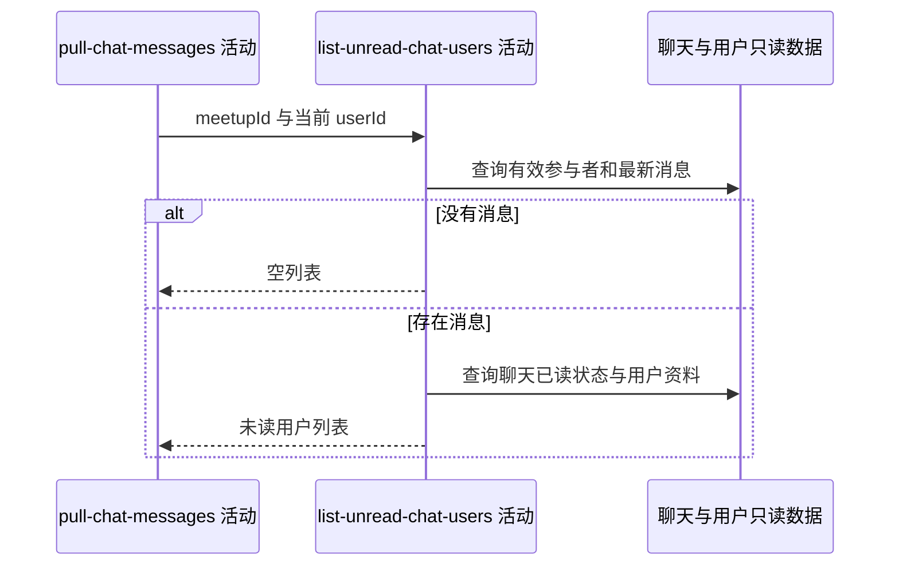

## 概要

汇总尚未读到约球最新消息的有效参与者。

## 时序图

## 触发条件

上游消息拉取完成且调用方明确请求未读用户时执行；未请求时本活动不运行。

## 活动契约

### 入参

| 字段 | 类型 | 必填 | 约束 |
|---|---|---|---|
| `meetupId` | 字符串 | 是 | 已通过参与资格校验的约球编号 |
| `currentUserId` | 字符串 | 是 | 从候选参与者中排除的当前用户 |

### 成功返回

| 字段 | 类型 | 必填 | 说明 |
|---|---|---|---|
| `unreadUsers` | 用户列表 | 是 | 未读到最新消息的有效参与者，含 userId、可空昵称头像与可空最后阅读时间；无消息时为空列表 |

## 异常分支

| 错误标识 | 触发条件 | 来源 |
|---|---|---|
| `SYSTEM_ERROR` | 参与者、最新消息、聊天状态或用户资料读取失败 | pull-chat-messages 流程 `SYSTEM_ERROR` 一行 |

## 领域依赖

无

## 业务动作

A1 取得除当前用户外的有效参与者编号
A2 以约球最新消息判断每位候选的未读状态
A3 批量补充未读用户当前昵称与头像
A4 组装未读用户列表

## 详细流程

1. `A1` 从报名记录中保留 `JOINED`、`REVIEWED`、`SKIPPED`，排除当前用户；`PENDING` 不进入候选。
2. 创建者不被额外强制加入候选，仅当其也有上述有效报名且不是当前用户时进入。
3. `A2` 取当前约球最大的消息 `biz_id`；没有消息时直接返回空列表。
4. 批量读取约球聊天成员状态。候选没有记录时视为未读、最后阅读时间为空；记录已读位置为空或小于最新消息业务编号时也视为未读。
5. `A3` 批量查询未读用户资料；资料缺失仍保留 userId，昵称与头像为空。
6. `A4` 沿候选与未读判定的现有顺序组装结果，不追加排序。

## 边界情况

- 未请求未读用户时流程把字段置为 `null`，本活动不运行。
- 无任何消息时人人按已读处理，返回空列表。
- 从未加入聊天或已退出聊天的有效参与者，在存在消息时视为未读。
- 当前用户始终排除，即使其已读状态落后。
- 用户资料缺失不导致整项丢失。

## 实现提示

查询按表批量完成，避免逐用户回查；雪花业务编号比较需维持等长字符串前提。
