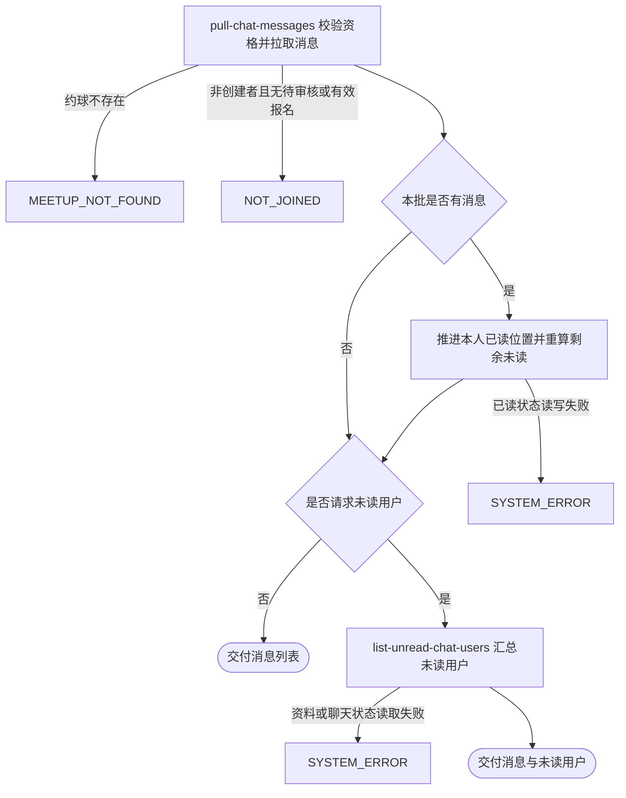

## 概要

为约球参与者按游标拉取消息，推进本人已读位置并按需交付未读用户。

## 触发

约球创建者或报名成员打开聊天页、轮询新消息或刷新未读成员时发起，调用方是登录用户端。一次请求只处理一个约球；调用方自行保存并回传消息游标。该查询会同步推进本人的数据库已读位置，因此不是纯读取操作。

## 接口契约

### 请求参数

| 字段 | 类型 | 必填 | 约束 |
|---|---|---|---|
| `meetupId` | 字符串 | 是 | 目标约球编号 |
| `lastMessageId` | 字符串 | 否 | 上次已交付的消息编号；空白时仅从最近 200 条范围开始 |
| `limit` | 整数 | 否 | 默认 20；大于零时限制数量，零或负数时当前实现不限制 |
| `withUnreadUsers` | 布尔值 | 否 | 默认 false；为 true 时附带未读到最新消息的参与者 |

### 成功响应

| 字段 | 类型 | 说明 |
|---|---|---|
| `messages` | 消息列表 | 按消息编号升序交付游标之后的消息 |
| `messages[].messageId` | 字符串 | 消息编号，也是后续拉取游标 |
| `messages[].meetupId` | 字符串 | 所属约球编号 |
| `messages[].senderId` | 字符串 | 发送者用户编号 |
| `messages[].senderName` | 字符串 | 发送时保存的发送者昵称 |
| `messages[].senderAvatar` | 字符串 | 发送时保存的发送者头像 |
| `messages[].content` | 字符串 | 消息内容 |
| `messages[].contentType` | 字符串 | `TEXT`、`IMAGE` 或 `LOCATION` |
| `messages[].createTime` | 日期时间 | 消息发送时间，格式 `yyyy-MM-dd HH:mm:ss` |
| `unreadUsers` | 用户列表或空值 | 未请求时为空值；请求时为尚未读到约球最新消息的有效参与者 |
| `unreadUsers[].userId` | 字符串 | 未读用户编号 |
| `unreadUsers[].nickname` | 字符串或空值 | 当前昵称；资料缺失时可为空 |
| `unreadUsers[].avatarUrl` | 字符串或空值 | 当前头像；资料缺失时可为空 |
| `unreadUsers[].lastReadTime` | 日期时间或空值 | 最近阅读时间；从未建立聊天记录时为空 |

## 业务活动

- pull-chat-messages  校验约球参与资格，按游标拉取消息并只向前推进本人的已读位置
- list-unread-chat-users  在调用方请求时，以最新消息为基准汇总其他有效参与者的未读状态

## 流程图

## 详细流程

1. 识别当前登录用户，读取约球及其报名记录；创建者直接通过，其他用户须存在待审核或有效报名记录。
2. 调用方提供上一条消息编号时，从该编号之后开始查询；未提供时先把查询起点定位到最近 200 条消息之前。
3. 按消息编号升序查询该约球的消息，默认最多返回 20 条；仅当 `limit` 大于零时施加数量限制。
4. 本批没有消息时保持本人的聊天已读记录不变；有消息时取本批最后一条消息编号作为拟推进位置。
5. 本人没有聊天成员记录时，以拟推进位置建立记录，并按该位置之后的消息数设置剩余未读数；已有记录时仅在拟推进位置更靠后时更新已读位置、时间并重算剩余未读数。
6. 把消息转换为包含消息编号、约球编号、发送者快照、内容、类型和发送时间的列表。
7. `withUnreadUsers` 为真时，以除本人外的有效参与者为范围，找出尚未读到约球最新消息的人；补充其昵称、头像和最后阅读时间。无任何消息时返回空列表。
8. 交付消息列表；未请求未读用户时该字段为空，请求时交付计算结果。

## 异常分支

| 对外失败码 | 触发条件 | 由哪个活动报出 | 补偿动作或超时处理 | 对外提示 |
|---|---|---|---|---|
| `MEETUP_NOT_FOUND` | 约球编号不存在 | pull-chat-messages | 未查询消息，未变更已读状态 | 约球不存在 |
| `NOT_JOINED` | 当前用户不是创建者，也没有待审核或有效报名 | pull-chat-messages | 未查询消息，未变更已读状态 | 你未报名该约球 |
| `SYSTEM_ERROR` | 消息、聊天成员或用户资料读取失败，或已读状态写入失败 | pull-chat-messages / list-unread-chat-users | 没有显式事务或补偿；已有记录可能已推进位置但未完成未读数校准，调用方可重试拉取 | 系统异常，请稍后重试 |

无游标且历史超过 200 条时，更早消息不在本接口首拉范围内；游标不存在或属于其他约球时当前不会单独校验，只按其编号作为查询下界。返回空消息批次时不建立或更新本人的聊天记录。

## 技术线索

- 表 `meetup` 与约球报名记录：核实创建者、待审核报名或有效报名资格
- 表 `chat_message`：按 `ref_id` 和雪花消息编号升序拉取，并查询最新消息与位置之后的数量
- 表 `chat_user`：保存本人最后阅读消息、阅读时间和剩余未读数
- 表 `user`：在请求未读用户时补充当前昵称与头像
