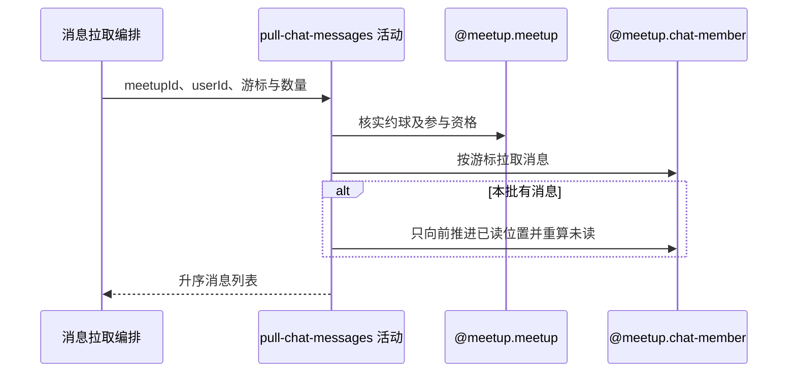

## 概要

校验参与资格、拉取消息并推进本人已读位置。

## 时序图

## 触发条件

已登录用户打开或轮询一个约球聊天时执行；调用方自行维护消息游标。

## 活动契约

### 入参

| 字段 | 类型 | 必填 | 约束 |
|---|---|---|---|
| `meetupId` | 字符串 | 是 | 目标约球编号 |
| `userId` | 字符串 | 是 | 当前登录用户编号 |
| `lastMessageId` | 字符串 | 否 | 空白时从最近 200 条历史范围开始 |
| `limit` | 整数 | 否 | 默认 20；正数限制数量，0 或负数不限制 |

### 成功返回

| 字段 | 类型 | 必填 | 说明 |
|---|---|---|---|
| `messages` | 消息列表 | 是 | 按消息业务编号升序；含消息编号、约球编号、发送者快照、内容、类型和发送时间 |

## 异常分支

| 错误标识 | 触发条件 | 来源 |
|---|---|---|
| `MEETUP_NOT_FOUND` | 约球编号不存在 | pull-chat-messages 流程 `MEETUP_NOT_FOUND` 一行 |
| `NOT_JOINED` | 当前用户不是创建者且无待审核或有效报名 | pull-chat-messages 流程 `NOT_JOINED` 一行 |
| `SYSTEM_ERROR` | 消息或聊天成员读取失败，或已读状态写入失败 | pull-chat-messages 流程 `SYSTEM_ERROR` 一行 |

## 领域依赖

### @meetup.meetup

- 输入：约球编号、当前用户编号与核实聊天参与资格的意图
- 输出：约球存在且创建者或具有待审核/有效报名时返回参与资格；不存在或无资格时返回相应失败结论

### @meetup.chat-member

- 输入：约球编号、当前用户编号、调用方游标和数量限制，以及在交付消息后推进本人已读位置的意图
- 输出：按业务编号升序的消息批次，并在批次非空时让本人已读位置只向前移动、重算剩余未读；读写失败时返回失败结论

## 业务动作

A1 核实约球存在且当前用户具有聊天参与资格
A2 解析首拉历史下界并按游标升序取得消息
A3 以本批最后消息只向前推进本人已读位置
A4 转换并交付消息列表

## 详细流程

1. `A1` 先加载约球；创建者直接通过，其他用户须有 `PENDING`、`JOINED`、`REVIEWED` 或 `SKIPPED` 报名。
2. `A2` 在游标空白时，按消息业务编号倒序跳过最近 200 条，取再前一条作为查询下界；历史不足时不设下界。
3. 非空游标不校验是否存在或属于本约球，直接查询当前约球 `biz_id > lastMessageId` 的消息，按 `biz_id` 升序。
4. `limit` 为正数时施加限制；为 `null` 时使用流程默认 20，为 0 或负数时不限制。
5. `A3` 空批次不改变聊天成员记录。有消息时取最后一条业务编号作为拟推进位置。
6. 本人无聊天成员记录时建立记录，已读位置为拟推进值，阅读时间与加入时间取当前时间，未读数取该位置后的消息数。
7. 已有记录仅当拟推进值按等长雪花字符串比较更大时，先更新已读位置和时间，再重算并更新未读数；无覆盖两次写入的显式总事务。
8. `A4` 映射消息快照字段并返回，拉取游标始终由调用方保存。

## 边界情况

- 首拉历史超过 200 条时，更早消息不会由本次首拉覆盖。
- 游标来自其他约球或不存在时不会报错，只作为字符串下界。
- 0 或负数 limit 可能返回全部下界后消息。
- 已读位置不会因旧游标拉取而回退。
- 已读位置更新成功、未读数更新失败时可能短暂不一致，重试可重新校准。

## 实现提示

保持消息业务编号作为唯一游标口径；若要求已读位置与未读数强一致，应在领域层收敛为单次原子更新。
