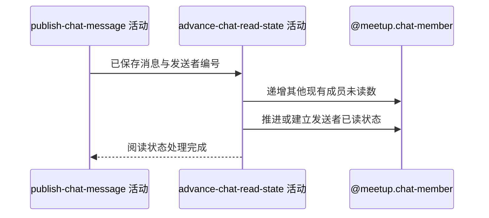

## 概要

递增其他成员未读数并推进发送者已读位置。

## 时序图

## 触发条件

同服务上游已成功保存一条新聊天消息后执行。

## 活动契约

### 入参

| 字段 | 类型 | 必填 | 约束 |
|---|---|---|---|
| `meetupId` | 字符串 | 是 | 新消息所属约球编号 |
| `messageId` | 字符串 | 是 | 已持久化的新消息雪花业务编号 |
| `senderId` | 字符串 | 是 | 新消息发送者编号 |

### 成功返回

无业务数据；完成未读递增和发送者已读推进。

## 异常分支

| 错误标识 | 触发条件 | 来源 |
|---|---|---|
| `SYSTEM_ERROR` | 任一聊天成员状态读取或写入失败 | send-chat-message 流程 `SYSTEM_ERROR` 一行 |

## 领域依赖

### @meetup.chat-member

- 输入：约球编号、新消息编号、发送者编号，以及递增其他现有成员未读数并推进发送者已读位置的意图
- 输出：其他已有成员未读数各增加一，发送者已读位置只向前移动或首次建立；任一读写失败时返回失败结论

## 业务动作

A1 递增约球内除发送者外现有聊天成员未读数
A2 以新消息推进或建立发送者已读状态
A3 确认阅读状态处理完成

## 详细流程

1. `A1` 对相同 `ref_id` 且 `user_id != senderId` 的现有聊天成员执行 `unread_count + 1`；不按报名状态过滤。
2. 没有聊天成员记录的其他参与者不在此时建立记录，之后首次拉取时再形成本人状态。
3. `A2` 发送者无记录时建立记录，已读位置取新消息，阅读时间与加入时间取当前时间，未读数取该位置后的消息数。
4. 发送者已有记录时，仅当新消息编号按等长雪花字符串比较更大才更新位置与时间，并重算剩余未读；不允许回退。
5. 先执行他人未读递增，再推进发送者；没有覆盖上游消息保存及本活动多次写入的显式总事务。
6. 任一步失败时报 `SYSTEM_ERROR`，不删除已保存消息，也不统一回滚已完成状态更新。

## 边界情况

- 约球没有其他现有聊天成员时，未读递增影响 0 行后仍继续。
- 发送者不在聊天成员表时会首次建立记录。
- 消息已经保存但本活动失败时，客户端重试发送会新建另一条消息。
- 递增成功而发送者推进失败时，阅读状态会部分完成。

## 实现提示

若要求消息与阅读状态原子提交，应由领域层统一事务边界；当前实现需保留足够日志支持后续校准。
