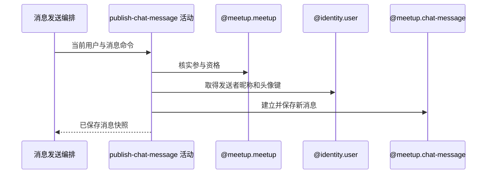

## 概要

校验发送资格并保存带发送者快照的聊天消息。

## 时序图

## 触发条件

已登录用户提交通过必填与消息类型校验的约球聊天消息后执行；不要求约球处于特定状态。

## 活动契约

### 入参

| 字段 | 类型 | 必填 | 约束 |
|---|---|---|---|
| `meetupId` | 字符串 | 是 | 非空白 |
| `senderId` | 字符串 | 是 | 当前登录用户编号 |
| `content` | 字符串 | 是 | 非空白；无长度、格式与频率限制 |
| `contentType` | 枚举 | 是 | `TEXT`、`IMAGE`、`LOCATION` |

### 成功返回

| 字段 | 类型 | 必填 | 说明 |
|---|---|---|---|
| `message` | 消息 | 是 | 新消息编号、约球编号、发送者编号及昵称头像键快照、内容、类型和创建时间 |

## 异常分支

| 错误标识 | 触发条件 | 来源 |
|---|---|---|
| `MEETUP_NOT_FOUND` | 目标约球不存在 | send-chat-message 流程 `MEETUP_NOT_FOUND` 一行 |
| `NOT_JOINED` | 发送者不是创建者且无待审核或有效报名 | send-chat-message 流程 `NOT_JOINED` 一行 |
| `TOKEN_INVALID` | 发送者用户资料不存在 | send-chat-message 流程 `TOKEN_INVALID` 一行 |
| `SYSTEM_ERROR` | 资格或资料读取失败，或消息保存失败 | send-chat-message 流程 `SYSTEM_ERROR` 一行 |

## 领域依赖

### @meetup.meetup

- 输入：约球编号、发送者编号与核实聊天参与资格的意图
- 输出：创建者或具有待审核/有效报名时允许发送；约球不存在或无资格时返回失败结论

### @identity.user

- 输入：发送者用户编号与取得当前展示资料的意图
- 输出：返回当前昵称与头像资源键；用户不存在或读取失败时返回失败结论

### @meetup.chat-message

- 输入：新消息编号、约球编号、发送者资料快照、内容、类型和创建时间
- 输出：持久化一条不可重复的新消息并返回消息快照；保存异常时返回失败结论

## 业务动作

A1 核实约球存在且发送者具有聊天参与资格
A2 取得发送者当前昵称与头像键
A3 生成消息编号和时间并保存发送者快照与内容
A4 返回已保存消息供后续阅读状态处理

## 详细流程

1. `A1` 创建者直接通过；其他用户须有 `PENDING`、`JOINED`、`REVIEWED` 或 `SKIPPED` 报名，不检查约球状态。
2. `A2` 按发送者编号取得用户资料；不存在时报 `TOKEN_INVALID`。昵称与头像键按当时值进入消息快照，不先转换访问 URL。
3. `A3` 每次生成新雪花业务编号和当前时间，保存 `meetupId`、发送者快照、内容与类型。
4. 不使用客户端幂等键、不按内容查重；保存失败时报 `SYSTEM_ERROR`，成功消息不由本活动更新阅读状态。
5. `A4` 返回持久化后的消息，供同服务下游活动使用。

## 边界情况

- 待审核报名者允许发送；拒绝、撤回或退出者不允许。
- 发送者昵称或头像为空时当前不额外拒绝，按快照保存。
- 相同内容重复请求会产生不同消息编号。
- 内容可能远大于常规文本，当前仅受请求与数据库容量约束。

## 实现提示

消息内保存头像键而非签名 URL；访问地址转换留给交付编排，避免签名结果固化进历史快照。
