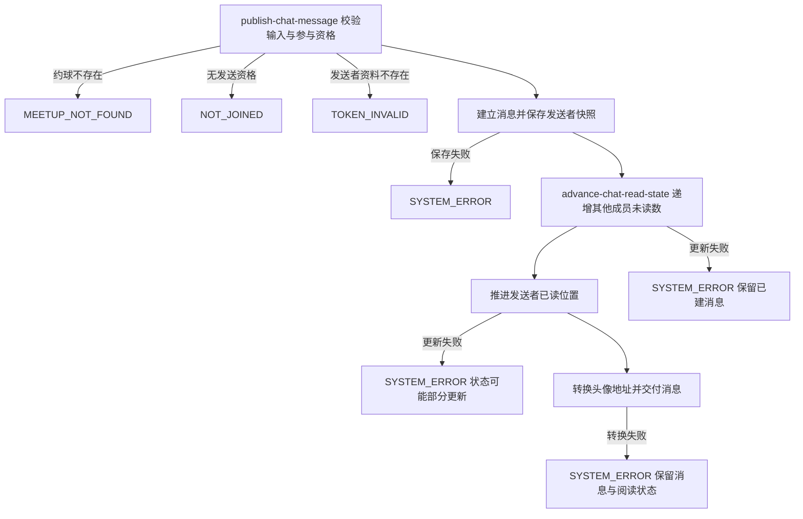

## 概要

为约球参与者发布群聊消息，并同步推进成员阅读状态。

## 触发

约球创建者或报名成员在群聊中提交文本、图片或位置消息时发起，调用方是登录用户端。一次请求建立一条新消息；没有客户端幂等键或重复内容识别，失败后重试会再次建立消息。本流程不限制约球状态，也会接受待审核报名者。

## 接口契约

### 请求参数

| 字段 | 类型 | 必填 | 约束 |
|---|---|---|---|
| `meetupId` | 字符串 | 是 | 不可为空白，目标约球编号 |
| `content` | 字符串 | 是 | 不可为空白；当前没有长度、格式或频率限制 |
| `contentType` | 枚举 | 是 | `TEXT`、`IMAGE` 或 `LOCATION` |

### 成功响应

| 字段 | 类型 | 说明 |
|---|---|---|
| `messageId` | 字符串 | 本次建立的消息编号 |
| `meetupId` | 字符串 | 所属约球编号 |
| `senderId` | 字符串 | 当前发送者用户编号 |
| `senderName` | 字符串 | 发送时保存的昵称 |
| `senderAvatar` | 字符串 | 由发送时保存的头像键转换出的访问地址 |
| `content` | 字符串 | 消息内容 |
| `contentType` | 字符串 | 消息类型 |
| `createTime` | 日期时间 | 发送时间，格式 `yyyy-MM-dd HH:mm:ss` |

## 业务活动

- publish-chat-message  校验参与资格并用发送者资料快照建立一条约球群聊消息
- advance-chat-read-state  增加其他已有聊天成员的未读数，并把发送者已读位置推进到新消息

## 流程图

## 详细流程

1. 接收目标约球、非空消息内容和消息类型，识别当前登录用户。
2. 读取约球及报名记录；创建者直接通过，其他用户须存在待审核或有效报名记录，且不校验约球当前状态。
3. 读取发送者用户资料，取当前昵称和头像键作为消息中的展示快照。
4. 生成新消息编号和发送时间，按目标约球、发送者、内容、类型及资料快照建立消息。
5. 将该约球已有聊天成员中除发送者外的每个人未读数增加一条；尚无聊天成员记录的参与者不会在此时建立记录。
6. 将发送者已读位置推进到新消息：没有聊天成员记录时建立并计算该位置之后的剩余未读数；已有记录时只向前更新位置、时间和剩余未读数。
7. 将保存的头像键转换为可访问地址，交付新消息编号、约球编号、发送者快照、内容、类型和发送时间。

## 异常分支

| 对外失败码 | 触发条件 | 由哪个活动报出 | 补偿动作或超时处理 | 对外提示 |
|---|---|---|---|---|
| 请求校验失败 | `meetupId`、`content` 为空白，或 `contentType` 未提供 | 流程 | 未读取约球，未建立消息 | 对应字段不能为空 |
| `SYSTEM_ERROR` | `contentType` 不能转换为允许枚举，或底层读写及头像地址转换失败 | 流程 / publish-chat-message / advance-chat-read-state | 没有显式事务或补偿；若消息已经保存则不会撤回，阅读状态可能部分更新 | 系统异常，请稍后重试 |
| `MEETUP_NOT_FOUND` | 目标约球不存在 | publish-chat-message | 未建立消息，阅读状态不变 | 约球不存在 |
| `NOT_JOINED` | 当前用户不是创建者，也没有待审核或有效报名 | publish-chat-message | 未建立消息，阅读状态不变 | 你未报名该约球 |
| `TOKEN_INVALID` | 发送者用户资料不存在 | publish-chat-message | 未建立消息，阅读状态不变 | 登录凭证无效，请重新登录 |

消息保存后任一步失败都不会生成可供客户端去重的结果；调用方重试会形成新消息。其他成员未读数只更新已有聊天成员记录，尚无记录的参与者在之后首次拉取消息时才建立本人记录。

## 技术线索

- 表 `meetup` 与约球报名记录：核实创建者、待审核报名或有效报名资格
- 表 `user`：读取发送者当前昵称与头像键
- 表 `chat_message`：保存雪花编号、发送者资料快照、内容、类型和发送时间
- 表 `chat_user`：批量递增其他已有成员未读数，保存发送者最后阅读位置与剩余未读数
- 外部能力：七牛云头像键转换为签名访问地址
