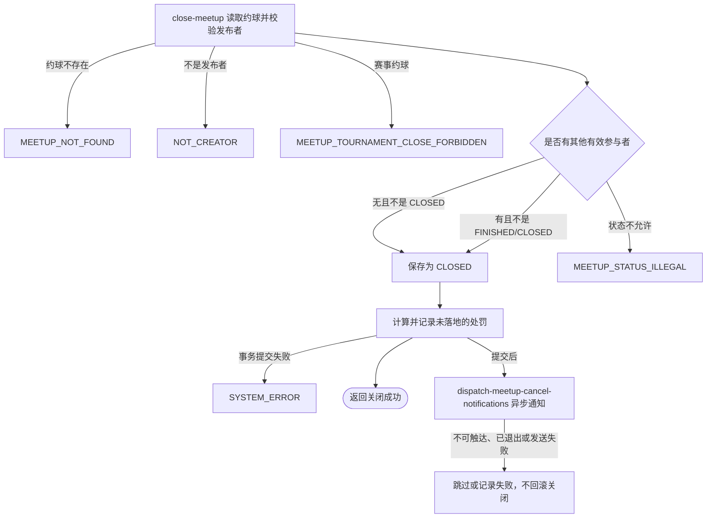

## 概要

由发布者关闭普通约球，并在提交后通知仍有效的参与者。

## 触发

普通约球发布者决定终止本人创建的活动时发起，调用方是登录用户端。一次请求关闭一个约球，核心状态变更在事务内完成；参与者通知只在事务提交后异步触发，接口成功不表示通知已经送达。

## 接口契约

### 请求参数

| 字段 | 类型 | 必填 | 约束 |
|---|---|---|---|
| `meetupId` | 字符串 | 是 | 请求参数中的目标约球编号 |

### 成功响应

无业务数据；成功表示普通约球状态已经提交为 `CLOSED`，不表示处罚已经执行或参与者通知已经送达。

## 业务活动

- close-meetup  校验发布者、约球性质和实际状态，将普通约球保存为已关闭
- dispatch-meetup-cancel-notifications  在关闭事务提交后筛选仍有效的其他参与者并尝试发送取消通知

## 流程图

## 详细流程

1. 识别当前登录用户，按约球编号读取约球及全部报名记录。
2. 确认当前用户是发布者，且目标不是赛事约球；按实际时间计算约球状态。
3. 没有其他有效参与者时，除已关闭外任何实际状态都允许关闭；存在其他有效参与者时，实际已结束或已关闭不允许关闭。
4. 将约球状态保存为已关闭，报名记录、群聊、比分、评价和费用保持不变。
5. 当前参与人数大于一时，从系统配置读取四档关闭处罚值并按距开始时间计算处罚；当前实现只记录日志，不实际扣减信誉分。
6. 发送前再次校验候选人仍具备通知资格；已退出者跳过且不建触达日志，其他候选人按事件、接收人和渠道建立唯一日志后，通过微信接收约球名称、时间、地点和“创建人取消”。
7. 未订阅、触达日志读写失败、渠道缺失或发送失败只记录结果，不改变已经提交的关闭结果；接口不等待异步通知完成即返回成功。

## 异常分支

| 对外失败码 | 触发条件 | 由哪个活动报出 | 补偿动作或超时处理 | 对外提示 |
|---|---|---|---|---|
| `MEETUP_NOT_FOUND` | 指定约球不存在 | close-meetup | 事务不修改约球 | 约球不存在 |
| `NOT_CREATOR` | 当前用户不是约球发布者 | close-meetup | 事务不修改约球 | 仅发布者可操作 |
| `MEETUP_TOURNAMENT_CLOSE_FORBIDDEN` | 指定约球是赛事约球 | close-meetup | 事务不修改约球 | 这是赛事约球，无法在此关闭，请返回比赛页面进行相关操作 |
| `MEETUP_STATUS_ILLEGAL` | 已关闭，或有其他有效参与者且实际状态已结束 | close-meetup | 事务不修改约球 | 约球状态不允许该操作 |
| `SYSTEM_ERROR` | 约球读写、处罚配置读取或事务提交失败 | close-meetup | 事务回滚核心关闭变更，不触发提交后通知 | 系统异常，请稍后重试 |

通知阶段不再改变接口结果：发送前确认已退出则跳过；通知资格校验异常时按可发送处理；未订阅或缺少微信身份记 `SKIPPED`，渠道缺失或微信发送失败记 `FAILED`，触达日志读写异常只记应用日志，均不回滚 `CLOSED`。

## 技术线索

- 表 `meetup` 与报名记录：读取发布者、约球类型、时间、状态、当前人数和有效参与者并保存 `CLOSED`
- 系统配置 `meetup.cancel.penalty_*`：按距开始时间计算四档处罚，目前仅记录日志
- 触达日志：事务提交后按取消事件、接收人和渠道建立唯一日志并直接尝试发送
- 外部系统：微信订阅消息，发送约球名称、时间、地点和取消原因
