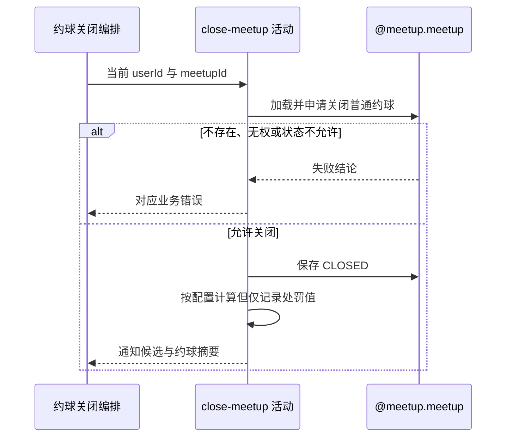

## 概要

校验关闭资格并将普通约球提交为已关闭。

## 时序图

## 触发条件

已登录用户请求关闭本人创建的一个普通约球时执行；核心状态变更在事务内完成。

## 活动契约

### 入参

| 字段 | 类型 | 必填 | 约束 |
|---|---|---|---|
| `meetupId` | 字符串 | 是 | 目标约球编号 |
| `operatorId` | 字符串 | 是 | 当前登录用户编号，必须为发布者 |

### 成功返回

| 字段 | 类型 | 必填 | 说明 |
|---|---|---|---|
| `recipientIds` | 用户编号列表 | 是 | 除发布者外仍处于有效参与状态的通知候选 |
| `noticeData` | 约球摘要 | 是 | 约球名称、开始时间、地点及取消通知所需资料 |

## 异常分支

| 错误标识 | 触发条件 | 来源 |
|---|---|---|
| `MEETUP_NOT_FOUND` | 指定约球不存在 | close-meetup 流程 `MEETUP_NOT_FOUND` 一行 |
| `NOT_CREATOR` | 操作人不是约球发布者 | close-meetup 流程 `NOT_CREATOR` 一行 |
| `MEETUP_TOURNAMENT_CLOSE_FORBIDDEN` | 目标为赛事约球 | close-meetup 流程 `MEETUP_TOURNAMENT_CLOSE_FORBIDDEN` 一行 |
| `MEETUP_STATUS_ILLEGAL` | 实际状态与参与者情况不允许关闭 | close-meetup 流程 `MEETUP_STATUS_ILLEGAL` 一行 |
| `SYSTEM_ERROR` | 约球读写、处罚配置读取或事务提交失败 | close-meetup 流程 `SYSTEM_ERROR` 一行 |

## 领域依赖

### @meetup.meetup

- 输入：约球编号、操作人编号，以及按当前时间、约球类型、实际状态和有效参与者判断并关闭的意图
- 输出：允许时将普通约球状态保存为 `CLOSED` 并返回有效参与者及通知摘要；不存在、无权、类型或状态不允许、保存失败时返回相应结论

## 业务动作

A1 加载约球及报名并校验发布者和普通约球类型
A2 按实际状态与其他有效参与者判断关闭资格
A3 将约球状态保存为 CLOSED
A4 在需要时读取四档配置并计算、记录未落地处罚值
A5 形成提交后通知候选与约球摘要

## 详细流程

1. `A1` 仅发布者可操作，`meetup_type=TOURNAMENT` 时拒绝；约球不存在直接失败。
2. `A2` 按当前时间计算实际状态。没有其他 `JOINED/REVIEWED/SKIPPED` 参与者时，除 `CLOSED` 外都允许关闭，包括 `FINISHED`。
3. 有其他有效参与者时，实际 `FINISHED` 或 `CLOSED` 不允许关闭，其余状态允许。
4. `A3` 只把约球主状态保存为 `CLOSED`；报名、聊天、比分、评价和费用不变。
5. `A4` 仅当 `currentPlayers > 1` 时读取 24 小时外、12–24 小时、6–12 小时、6 小时内四档配置，按开始时间距当前时间取值。
6. 处罚值大于 0 时当前只写业务日志，不扣信誉分、不保存处罚记录。
7. `A1-A5` 处于核心事务内；保存、配置处理或提交失败时回滚关闭，不产生提交后通知。
8. `A5` 返回除发布者外的有效参与者及通知摘要，供下游提交后处理。

## 边界情况

- `currentPlayers > 1` 是触发处罚计算的口径，不重新以有效报名数量校准。
- 无其他有效参与者的已结束约球仍可关闭。
- 已关闭约球即使无人参与也不能重复关闭。
- 配置解析失败会使核心事务失败，而非跳过处罚计算。
- 成功仅代表 `CLOSED` 已提交，不代表实际扣分或通知送达。

## 实现提示

未落地的信誉处罚保持显式日志标记；在评分领域正式承接前，不把日志描述成已扣分事实。
