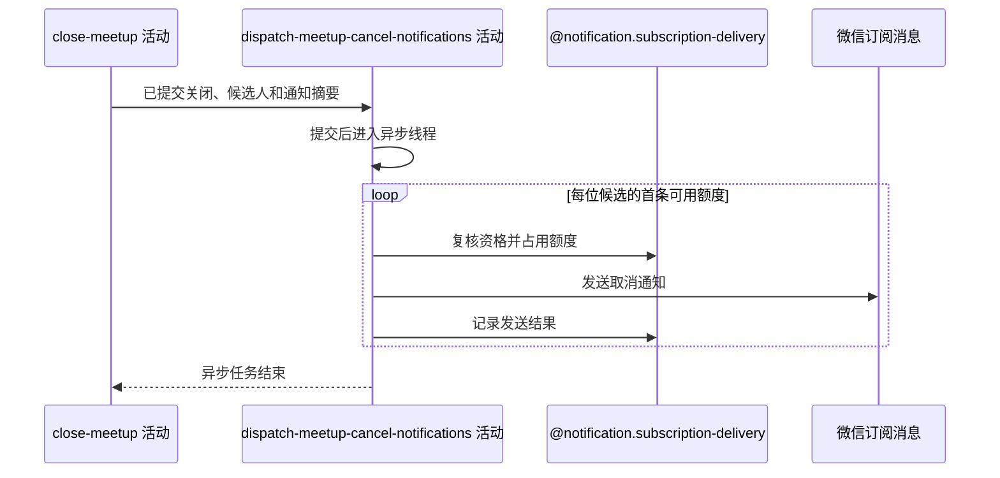

## 概要

提交后异步消费额度并发送约球取消通知。

## 时序图

## 触发条件

普通约球关闭事务成功提交后触发异步任务；没有候选接收人时不提交任务。

## 活动契约

### 入参

| 字段 | 类型 | 必填 | 约束 |
|---|---|---|---|
| `meetupId` | 字符串 | 是 | 已关闭普通约球编号 |
| `recipientIds` | 用户编号列表 | 是 | 除发布者外的有效参与者候选 |
| `noticeData` | 约球摘要 | 是 | 名称、时间、地点和固定取消原因所需数据 |

### 成功返回

无业务数据；所有通知均为尽力而为，任务结束不表示全部送达。

## 异常分支

无。额度、资格、渠道、微信发送或状态回写失败均在活动内记录并隔离，不改变上游关闭结果。

## 领域依赖

### @notification.subscription-delivery

- 输入：业务类型 `MEETUP`、约球编号、场景 `MEETUP_CANCEL`、候选用户，以及为每人选择并占用首条可用额度、记录发送结果的意图
- 输出：每位候选至多处理一条可用额度，成功或失败结果被记录；无额度、并发占用失败或存取异常时返回跳过/失败结论且不影响上游业务

## 业务动作

A1 在核心事务提交后异步启动通知任务
A2 查询候选用户的可用取消通知额度并每人选一条
A3 发送前复核参与资格并原子占用额度
A4 发送微信取消通知并记录每条结果

## 详细流程

1. `A1` 有活动事务时注册 `afterCommit`，提交成功后把任务交给通知线程池；没有事务时直接异步提交。
2. `A2` 查询 `MEETUP`、当前约球、`MEETUP_CANCEL`、`UNUSED` 流水，沿仓储顺序每个用户只处理第一条，其余额度保留。
3. `A3` 发送前重新判断用户仍可接收约球通知；已退出者跳过且额度保持 `UNUSED`，资格复核异常按仍可发送处理。
4. 对可发送额度执行 CAS `UNUSED -> SENDING`；并发占用失败时跳过。
5. `A4` 使用约球名称、时间、地点和固定原因“创建人取消”发送微信订阅消息，并把结果回写 `SENT` 或 `FAILED`。
6. 渠道缺失、微信身份缺失、发送异常或结果回写异常只记录；异常时尽力标记失败，不回滚 `CLOSED`。

## 边界情况

- 候选为空或没有可用额度时不发送且按任务成功结束。
- 接口响应不等待本活动完成。
- 同一用户有多条可用额度时一次只消费一条。
- 资格检查异常采取 fail-open，减少漏发；明确已退出才跳过。
- 通知线程池或进程在提交后丢失任务时当前无持久化重试队列。

## 实现提示

微信 RPC snapshot 当前缺失；敏感身份与模板请求不写完整日志，异步日志须包含约球、场景和额度流水标识以便排查。
