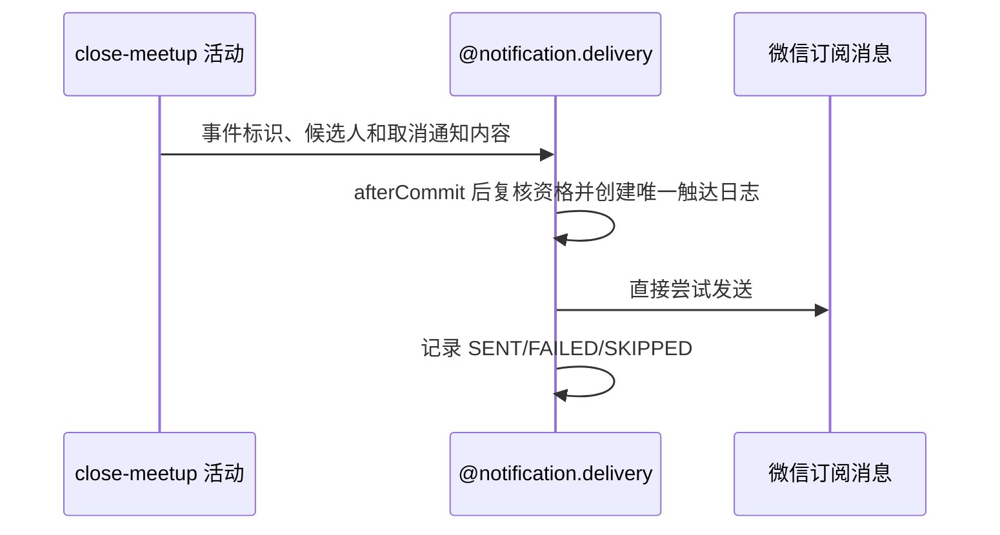

## 概要

约球关闭提交后，以 `MEETUP_CANCEL:meetupId` 为稳定事件标识，异步尝试触达除发布者外的有效参与者。

## 时序图

## 活动契约

入参包含已关闭约球编号、除发布者外的候选用户和活动名称、时间、地点、取消原因。成功只表示已安排尽力触达。

## 领域依赖

### @notification.delivery

## 详细流程

1. 仅在关闭事务成功提交后进入通知线程池。
2. 每位候选发送前重新判断是否仍为约球成员；明确退出者跳过，复核异常按可触达处理。
3. 触达日志首次创建成功才调用微信；重复任务由唯一键跳过。
4. 微信不可触达记 `SKIPPED`，其他错误记 `FAILED`，成功记 `SENT`；所有结果均不改变 `CLOSED`。

## 边界情况

- 候选人为空、未订阅或缺少渠道身份时不影响关闭结果。
- 日志创建失败时 fail-closed，不做无幂等保护的发送。
- 当前不等待触达结果且没有自动重试队列。
