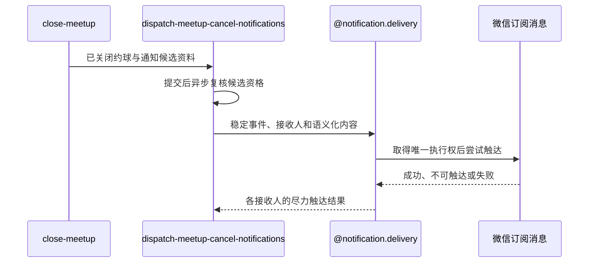

## 概要

约球关闭提交后尽力通知仍有效的其他参与者。

## 时序图

## 触发条件

普通约球关闭事务已经成功提交，并已形成除发布者外的通知候选人与取消通知内容。

## 活动契约

### 入参

| 字段 | 类型 | 必填 | 约束 |
|---|---|---|---|
| `meetupId` | 字符串 | 是 | 已提交为 `CLOSED` 的普通约球编号 |
| `creatorId` | 字符串 | 是 | 约球发布者，不得成为接收人 |
| `candidateUserIds` | 字符串列表 | 是 | 关闭提交时处于 `JOINED`、`REVIEWED` 或 `SKIPPED` 的其他参与者，可为空 |
| `meetupName` | 字符串 | 是 | 通知展示的活动名称 |
| `startTime` | 日期时间 | 是 | 通知展示的活动开始时间 |
| `courtName` | 字符串 | 是 | 通知展示的活动地点 |
| `cancelReason` | 字符串 | 是 | 固定表达创建人取消 |

### 成功返回

无业务数据；成功只表示已在关闭事务提交后安排尽力触达，不表示任何接收人已经收到消息。

## 异常分支

无。候选资格变化、重复事件、渠道不可达、触达日志或微信异常均在活动内跳过或记录，不再改变关闭流程结果。

## 领域依赖

### @notification.delivery

- 输入：`MEETUP_CANCEL:meetupId` 稳定事件、约球业务上下文、取消场景、复核后的接收人、语义化取消内容和微信订阅渠道。
- 输出：每个接收人与渠道取得唯一执行权后形成成功、失败或预期跳过的触达结果，重复任务不再次发送；异常时不向关闭流程传播失败，保留可审计结果或应用日志。

## 业务动作

- A1 在关闭事务提交后把通知任务交给异步执行。
- A2 去重候选人并排除发布者，逐人复核其报名仍为 `JOINED`、`REVIEWED` 或 `SKIPPED`。
- A3 以 `MEETUP_CANCEL:meetupId` 构造稳定事件和取消通知内容。
- A4 委托 `@notification.delivery` 为每位有效候选人取得微信触达执行权并尝试发送。
- A5 接受成功、失败、跳过或日志异常结果并结束，不修改已关闭约球。

## 详细流程

1. A1 仅在核心关闭事务成功提交后进入线程池；提交回滚时不启动通知。
2. A2 候选人为空时直接结束；报名已退出或不再有效时不建立该用户触达日志，资格复核异常按仍可触达继续。
3. A3 同一次约球关闭始终使用同一事件标识，消息包含约球名称、时间、地点和创建人取消原因。
4. A4 每个接收人独立处理；只有唯一触达日志首次创建成功才调用微信，重复任务和日志创建失败均不发送。
5. A5 微信缺少接收身份或未订阅时接受预期跳过，渠道缺失或调用失败时接受失败；日志结果回写异常只记应用日志，均不回滚 `CLOSED`。

## 边界情况

- 候选列表为空或全部候选已退出时正常结束。
- 候选列表重复时按用户去重，同一事件、接收人和渠道只允许一次执行。
- 发布者即使出现在候选列表中也必须排除。
- 进程中断可能留下 `SENDING` 触达日志；当前不自动重试，也不删除日志后盲目重发。

## 实现提示

无
