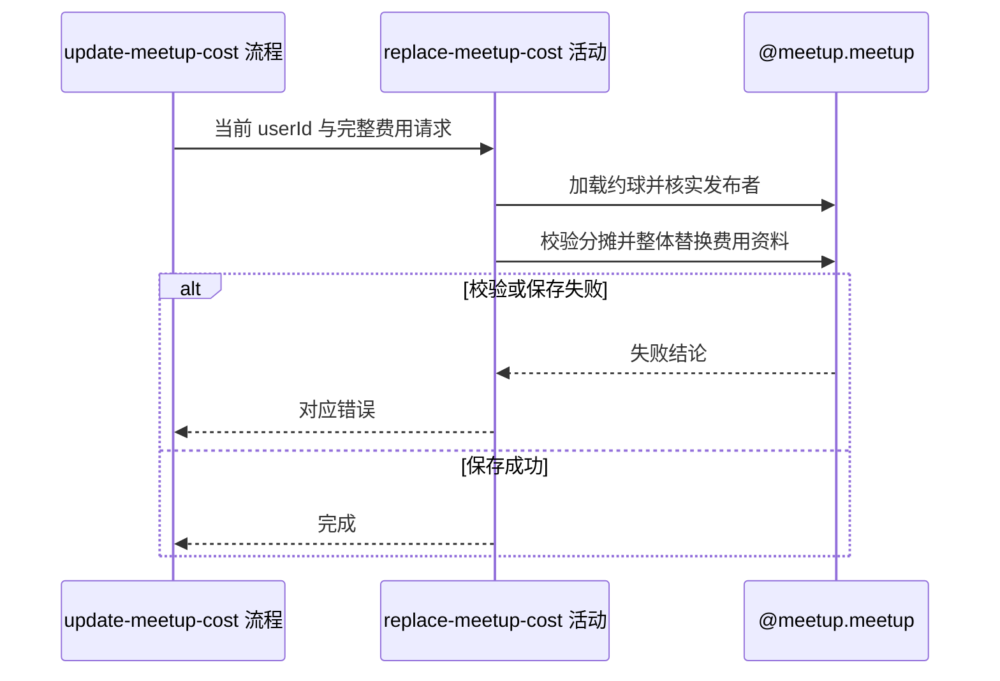

## 概要

校验发布者并整体替换约球费用与分摊资料。

## 时序图

## 触发条件

已登录约球发布者提交费用调整时执行；不限制约球类型、状态或距开始时间。

## 活动契约

### 入参

| 字段 | 类型 | 必填 | 约束 |
|---|---|---|---|
| `meetupId` | 字符串 | 是 | 非空白目标约球编号 |
| `operatorId` | 字符串 | 是 | 必须为发布者 |
| `costItems` | 费用项列表 | 否 | 不校验名称、金额、负数或重复；省略或空列表均整体替换原值 |
| `hourlyAllocations` | 分摊段列表 | 否 | 非空时须通过时长和参与人校验；省略或空列表均整体替换原值 |

### 成功返回

无业务数据，不返回费用计算结果或更新后约球详情。

## 异常分支

| 错误标识 | 触发条件 | 来源 |
|---|---|---|
| `MEETUP_NOT_FOUND` | 指定约球不存在 | update-meetup-cost 流程 `MEETUP_NOT_FOUND` 一行 |
| `NOT_CREATOR` | 操作人不是约球发布者 | update-meetup-cost 流程 `NOT_CREATOR` 一行 |
| `PARAM_ERROR` | 分摊总时长、单段时长、用户列表或参与资格不符合规则 | update-meetup-cost 流程 `PARAM_ERROR` 一行 |
| `SYSTEM_ERROR` | 分摊空字段引发处理失败或约球保存失败 | update-meetup-cost 流程 `SYSTEM_ERROR` 一行 |

## 领域依赖

### @meetup.meetup

- 输入：约球编号、操作人、完整费用项与按人时分摊方案，以及校验发布者和整体替换费用资料的意图
- 输出：权限与分摊规则通过时保存新的完整费用资料；约球不存在、无权、参数不合规或保存失败时返回相应结论

## 业务动作

A1 加载约球并核实操作人为发布者
A2 校验非空分摊方案的总时长、单段时长和参与用户
A3 用请求内容建立新的完整费用资料
A4 保存约球费用变更

## 详细流程

1. `A1` 只校验创建者权限，不检查普通/赛事类型、状态或活动时间，也不产生参与者通知。
2. `A2` 仅在分摊列表非空时执行：先汇总所有 `duration`，要求与约球持续时长按小数值精确相等。
3. 每段时长须大于 0、用户列表非空；每个用户必须是创建者或报名状态为 `JOINED`、`REVIEWED`、`SKIPPED` 的有效参与者。
4. 不限制分摊段数、时长精度、同段或跨段重复用户，也不要求覆盖所有有效参与者。
5. `A3` 不校验费用项的名称、金额、非负性或重复；新建费用资料并把请求中的两个列表原样整体赋值。
6. 字段为 `null` 或空列表都不沿用旧值，而是以本次对应值替换原资料。
7. `A4` 在应用事务内保存，只修改 `cost_data`；失败回滚本次替换。无版本控制，并发时后完成写覆盖。

## 边界情况

- 分摊段 `duration=null` 会在总和阶段失败，当前归 `SYSTEM_ERROR` 而非参数错误。
- 用户列表含空编号时可能在资格判断中失败或按无资格处理，当前不做独立字段校验。
- 费用项可保存空名称、空金额、负金额和重复名称，后续展示或计算可能失败。
- 空分摊列表清空旧方案，不要求其时长等于约球时长。
- 成功不计算总费用或个人应付额。

## 实现提示

保持整体替换语义与事务边界；若补强字段校验，需要同步调整 flow 对 `PARAM_ERROR` 与 `SYSTEM_ERROR` 的分档。
