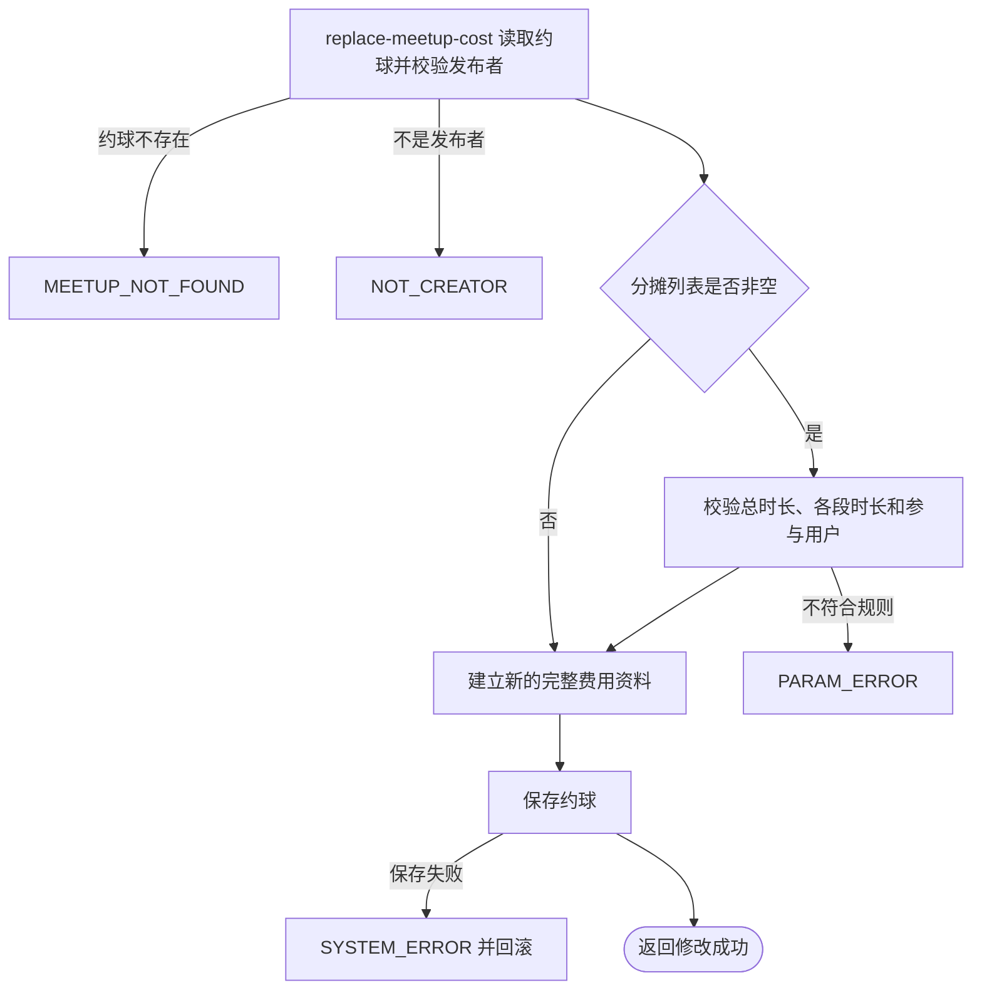

## 概要

由发布者完整替换约球费用明细与按人时分摊方案。

## 触发

约球发布者调整活动费用或分摊依据时发起，调用方是登录用户端。一次请求同时完整替换一个约球的费用明细和按人时分摊方案；该操作不受约球类型、状态或时间限制，也不通知参与者。

## 接口契约

### 请求参数

| 字段 | 类型 | 必填 | 约束 |
|---|---|---|---|
| `meetupId` | 字符串 | 是 | 不可为空白，目标约球编号 |
| `costItems` | 费用项列表 | 否 | 省略或空列表会清空原费用明细 |
| `costItems[].name` | 字符串 | 否 | 当前不校验非空、重复或长度 |
| `costItems[].totalAmount` | 整数 | 否 | 单位为分；当前不校验非空、非负或上限 |
| `hourlyAllocations` | 分摊段列表 | 否 | 省略或空列表会清空按人时方案 |
| `hourlyAllocations[].duration` | 小数 | 是 | 单位为小时，须大于零；各段之和须等于约球持续时长 |
| `hourlyAllocations[].userIds` | 用户编号列表 | 是 | 至少一人；每人须是发布者或有效参与者 |

### 成功响应

无业务数据；成功表示新的费用资料已经完整替换原值。接口不交付总费用、个人应付额或更新后的约球详情。

## 业务活动

- replace-meetup-cost  校验发布者与非空分摊方案，完整替换约球费用明细和分摊依据

## 流程图

## 详细流程

1. 接收非空约球编号、费用明细和可选按人时分摊方案，识别当前登录用户。
2. 读取约球及报名记录，只确认当前用户是发布者；不限制普通或赛事约球，也不限制约球状态和距开始时间。
3. 分摊列表非空时，先汇总各段时长并要求等于约球持续时长；任一空时长会在汇总阶段形成系统异常。
4. 逐段确认时长大于零、用户列表非空，且每个用户是发布者或报名状态为已加入、已评价、已跳过的有效参与者。
5. 当前不限制分摊段数、时长精度、用户重复或跨段出现，也不要求覆盖所有有效参与者。
6. 以请求中的费用明细和分摊列表建立新的费用资料，完整替换原值；字段未提交或提交空列表都会清空对应原值。
7. 保存约球；状态、报名、时间、场地等其他资料保持不变，成功响应不交付更新后详情。

## 异常分支

| 对外失败码 | 触发条件 | 由哪个活动报出 | 补偿动作或超时处理 | 对外提示 |
|---|---|---|---|---|
| 请求校验失败 | `meetupId` 为空白 | 流程 | 未读取或修改费用资料 | meetupId: 约球ID不能为空 |
| `MEETUP_NOT_FOUND` | 指定约球不存在 | replace-meetup-cost | 事务不修改约球 | 约球不存在 |
| `NOT_CREATOR` | 当前用户不是约球发布者 | replace-meetup-cost | 事务不修改约球 | 仅发布者可操作 |
| `PARAM_ERROR` | 分摊总时长不等于约球时长、某段时长不大于零、某段没有用户，或包含非发布者和非有效参与者 | replace-meetup-cost | 事务不修改约球 | 参数错误 |
| `SYSTEM_ERROR` | 分摊项或时长为空导致求和失败、用户编号为空导致资格判断失败，或约球保存失败 | replace-meetup-cost | 事务回滚本次费用修改，原费用资料保持不变 | 系统异常，请稍后重试 |

费用项本身没有业务校验，空项目、空名称、空金额、负数和重复名称可能被保存并在后续费用展示或计算时失败。同一用户可在一段内重复，也可跨段重复；方案可以不覆盖全部有效参与者。

## 技术线索

- 表 `meetup` 与报名记录：读取发布者、约球持续时长和有效参与者
- 约球费用资料 `costData`：整体保存 `costItems` 与 `hourlyAllocations`
- 事务边界：应用服务的费用修改方法，保存失败回滚本次替换
