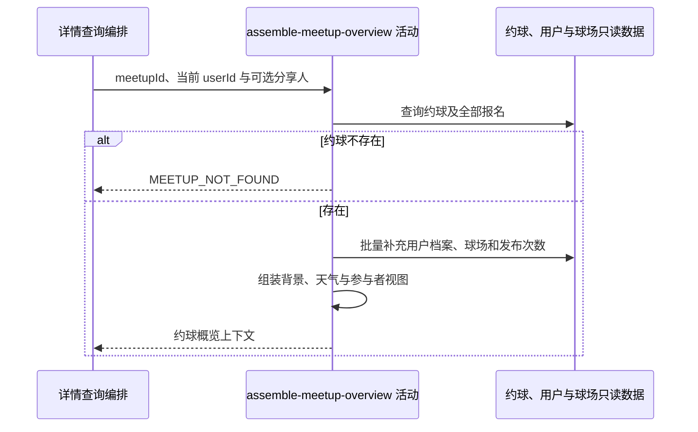

## 概要

组装约球、天气、发布者与视角化参与者概览。

## 时序图

## 触发条件

已登录用户从任意详情入口查看一个约球时首先执行；无需是约球参与者。

## 活动契约

### 入参

| 字段 | 类型 | 必填 | 约束 |
|---|---|---|---|
| `meetupId` | 字符串 | 是 | 目标约球编号 |
| `currentUserId` | 字符串 | 是 | 当前登录用户编号 |
| `shareUserId` | 字符串 | 否 | 仅用于日志，不影响结果 |

### 成功返回

| 字段 | 类型 | 必填 | 说明 |
|---|---|---|---|
| `meetup` | 约球概览 | 是 | 基本资料、人数、时间场地、准入条件、存储状态与背景图 |
| `creator` | 发布者概览 | 是 | 编号、展示资料、NTRP、性别与历史发布次数 |
| `participants` | 参与者视图 | 是 | 当前用户角色及按视角筛选的报名列表 |
| `weather` | 日照视图 | 是 | 按场地位置和活动时间计算的日出日落 |
| `meetupContext` | 查询上下文 | 是 | 后续活动所需约球及报名当前视图 |

## 异常分支

| 错误标识 | 触发条件 | 来源 |
|---|---|---|
| `MEETUP_NOT_FOUND` | 目标约球不存在 | get-meetup-detail 流程 `MEETUP_NOT_FOUND` 一行 |
| `SYSTEM_ERROR` | 约球、用户、档案、球场、配置读取或资源地址转换失败 | get-meetup-detail 流程 `SYSTEM_ERROR` 一行 |

## 领域依赖

无

## 业务动作

A1 查询约球及全部报名并形成当前时间视图
A2 按当前用户角色筛选可见报名参与者
A3 批量补充发布者与参与者用户档案
A4 解析球场背景、日出日落和发布者历史次数
A5 组装约球、发布者与参与者概览上下文

## 详细流程

1. `A1` 按编号读取约球和全部报名；`shareUserId` 非空时只记日志，不参与访问、归因或响应。
2. 保留约球存储 `status`，同时按当前时间、开始和结束时间形成供后续判断的实际状态视图。
3. `A2` 创建者看到 `PENDING` 及 `JOINED/REVIEWED/SKIPPED` 报名；非创建者只看到后三种有效报名。
4. `A3` 把可见参与者与创建者编号合并批量查 `user` 和 `user_tennis_profile`。参与者资料缺失仍保留报名编号、用户编号、状态和申请时间。
5. 发布者资料补昵称、签名头像、性别、NTRP，并按创建者编号统计全部历史发布记录；发布者资料缺失时当前性别组装失败并报 `SYSTEM_ERROR`。
6. 参与者档案存在时按信誉、可信和校准权重及阈值计算球友等级；相关系统配置读取失败终止查询。
7. `A4` 有 `courtId` 时读取球场材质与室内外类型选择背景，球场缺失时降级默认晴天背景；用活动开始时间、经纬度和上海时区口径计算日出日落。
8. `A5` 组装所有概览字段与后续只读上下文，不修改任何业务记录。

## 边界情况

- 任何已登录用户都可查看存在的约球。
- 参与者资料缺失时展示字段为空但报名仍返回；发布者资料缺失当前会失败。
- 创建者可能同时出现在参与者列表，批量用户查询会合并重复编号。
- 无球场库编号或球场缺失时仍返回背景降级值。
- 无档案的参与者不计算球友等级。

## 实现提示

保持用户与档案批量查询；七牛签名和日照算法异常统一映射查询失败，不把短期签名地址写回数据库。
