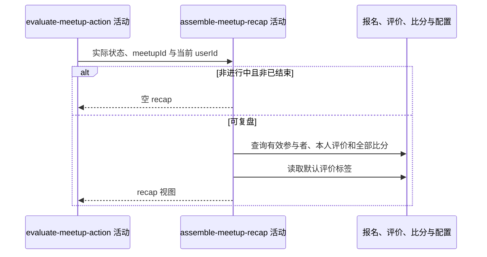

## 概要

组装进行中或已结束约球的评价与比分复盘。

## 时序图

## 触发条件

约球实际状态为 `ONGOING` 或 `FINISHED` 时执行；不额外要求当前用户是参与者。

## 活动契约

### 入参

| 字段 | 类型 | 必填 | 约束 |
|---|---|---|---|
| `meetupId` | 字符串 | 是 | 目标约球编号 |
| `currentUserId` | 字符串 | 是 | 本人评价与候选排除依据 |
| `realStatus` | 枚举 | 是 | 仅 `ONGOING`、`FINISHED` 形成复盘 |

### 成功返回

| 字段 | 类型 | 必填 | 说明 |
|---|---|---|---|
| `recap` | 复盘视图 | 否 | 含可评价用户、本人评价分组、比分、是否已填比分及默认标签；其他状态为空 |

## 异常分支

| 错误标识 | 触发条件 | 来源 |
|---|---|---|
| `SYSTEM_ERROR` | 报名、评价、比分或默认标签配置读取与转换失败 | get-meetup-detail 流程 `SYSTEM_ERROR` 一行 |

## 领域依赖

无

## 业务动作

A1 判断实际状态并取得除本人的有效参与者候选
A2 查询并按被评价人分组本人已提交评价
A3 查询约球全部比分并形成比分视图
A4 读取并拆分默认评价标签
A5 组装复盘视图

## 详细流程

1. `A1` 非 `ONGOING/FINISHED` 返回空；可复盘时从 `JOINED/REVIEWED/SKIPPED` 报名取除当前用户外编号作为 `waitlistIds`。
2. `A2` 查询 `meetupId` 且 `from_user_id=currentUserId` 的全部评价，按 `to_user_id` 分组并保留各评价维度和值。
3. `A3` 查询当前约球全部按盘比分，沿仓储现有顺序映射，不追加排序；列表非空时 `scoreFilled=true`。
4. `A4` 读取 `review.default_tags`，非空白时直接按逗号拆分，不裁剪、不去重；空白时不设置标签。
5. `A5` 即使没有评价或比分也返回包含空集合与状态的复盘对象。

## 边界情况

- 非参与者在进行中或已结束约球详情中也会得到复盘视图。
- 可评价候选不包含 `PENDING` 或当前用户。
- 比分没有显式排序保证，调用方不应依赖盘号顺序之外的仓储偶然顺序。
- 默认标签连续逗号或含空格会原样形成空项或带空格项。
- 配置读取失败不降级为空标签，而是整体详情失败。

## 实现提示

评价与比分均批量读取；如需稳定比分排序，应在查询层显式按盘号排序并同步更新契约。
