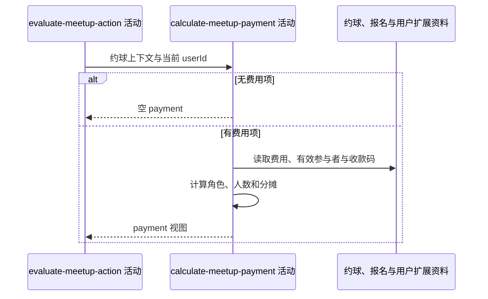

## 概要

计算费用角色、分摊金额和收款码视图。

## 时序图

## 触发条件

约球概览与操作状态已形成后执行；只有费用项非空时形成支付视图。

## 活动契约

### 入参

| 字段 | 类型 | 必填 | 约束 |
|---|---|---|---|
| `meetupContext` | 约球上下文 | 是 | 含费用资料、实际状态和报名 |
| `currentUserId` | 字符串 | 是 | 用于角色和本人分摊计算 |

### 成功返回

| 字段 | 类型 | 必填 | 说明 |
|---|---|---|---|
| `payment` | 支付视图 | 否 | 无费用项时为空；否则含角色、总额、计算人数、分摊模式、本人金额、说明与可选收款码 |

## 异常分支

| 错误标识 | 触发条件 | 来源 |
|---|---|---|
| `SYSTEM_ERROR` | 费用字段无法求和或分摊，用户扩展资料读取或收款码签名失败 | get-meetup-detail 流程 `SYSTEM_ERROR` 一行 |

## 领域依赖

无

## 业务动作

A1 判断费用项是否存在并识别当前用户角色
A2 按实际状态确定费用计算人数并汇总总额
A3 计算平均或按人时的本人金额与说明
A4 查询发布者收款码并转换访问地址
A5 组装支付视图

## 详细流程

1. `A1` 费用项为 `null` 或空列表时返回空视图；创建者为 `COLLECTOR`，有效参与者为 `PAYER`，其他人为 `STRANGER`。
2. `A2` 实际状态为 `OPEN` 时计算人数取 `maxPlayers`，其他状态取创建者加有效报名的已批准人数。
3. 总额按全部 `totalAmount` 整数求和；金额为空会导致 `SYSTEM_ERROR`。
4. `A3` 无非空人时方案时用 `AVERAGE`；人数大于 0 时整数除法得到本人金额，否则为 0。
5. 人时模式先以 `totalAmount / duration` 保留 2 位、四舍五入；对包含当前用户的每段按小时费率乘时长再除该段用户数，同样保留 2 位，累加后 `intValue` 截断为分。
6. 分摊说明仅汇总包含当前用户的段，按参与人数首次出现顺序合并时长，形如“4人2小时、3人1小时”；未命中时金额为 0、说明为空。
7. `A4` 不区分角色，查询发布者 `PAYMENT_CODE` 扩展；存在时把资源键转换为签名 URL，缺失时字段为空。
8. `A5` 返回原费用项、人数、总额、模式、方案、本人数额、说明和收款码。

## 边界情况

- 平均分摊的整数余数不另行分配。
- 人时总时长为 0/null、分段时长或用户列表非法时可能查询失败。
- 同一用户跨段出现会累计；段内重复用户会增大除数但 membership 只判包含。
- `STRANGER` 仍可看到计算金额与发布者收款码。
- 签名地址是临时视图，不写回扩展资料。

## 实现提示

保留金额单位“分”和既有舍入顺序；将来若修正规则需同时更新所有费用展示入口。
