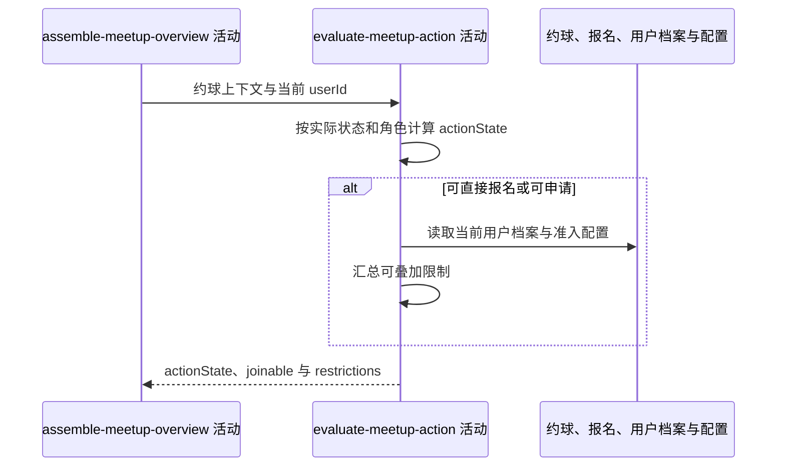

## 概要

计算当前操作状态与可报名时的全部准入限制。

## 时序图

## 触发条件

约球概览上下文已取得后执行；每次详情查询都计算操作状态，仅可报名状态继续计算限制。

## 活动契约

### 入参

| 字段 | 类型 | 必填 | 约束 |
|---|---|---|---|
| `meetupContext` | 约球上下文 | 是 | 含主资料与全部报名 |
| `currentUserId` | 字符串 | 是 | 当前登录用户编号 |

### 成功返回

| 字段 | 类型 | 必填 | 说明 |
|---|---|---|---|
| `actionState` | 枚举 | 是 | 当前用户在约球实际状态下的操作状态 |
| `joinable` | 布尔值 | 否 | 仅 `JOIN_DIRECT`/`APPLY_APPROVAL` 时返回，限制为空则 true |
| `restrictions` | 枚举列表 | 否 | 可叠加的资料、满员、性别、水平与信誉限制 |

## 异常分支

| 错误标识 | 触发条件 | 来源 |
|---|---|---|
| `SYSTEM_ERROR` | 当前用户资料、网球档案或系统配置读取与计算失败 | get-meetup-detail 流程 `SYSTEM_ERROR` 一行 |

## 领域依赖

无

## 业务动作

A1 按实际状态、创建者身份和报名状态计算操作状态
A2 仅在可报名状态读取当前用户基础资料和网球档案
A3 汇总全部资料完整度、容量、性别、水平与信誉限制
A4 由限制集合得出是否可报名

## 详细流程

1. `A1` 优先处理 `CLOSED`：有效参与者为 `CLOSED_JOINED`，其他人为 `CLOSED`。
2. 创建者且没有其他有效参与者时恒为 `OWNER_EDITABLE`；实际 `FINISHED` 且有其他参与者时，非参与者为 `FINISHED`，有效参与者按是否 `REVIEWED/SKIPPED` 分为 `FINISHED_JOINED` 或 `FINISHED_REVIEWED`。
3. 创建者有其他参与者时，实际进行中为 `ONGOING_JOINED`；否则读取编辑锁定分钟前后形成 `OWNER_EDITABLE` 或 `OWNER_EDIT_LOCKED`。
4. 非创建者有 `PENDING` 报名为 `PENDING_REVIEW`，有效报名在进行中为 `ONGOING_JOINED`、否则 `JOINED`；未报名者进行中为 `ONGOING`，其余按加入模式为 `JOIN_DIRECT` 或 `APPLY_APPROVAL`。
5. `A2` 仅后两种可报名状态读取本人资料；其他状态的 `joinable` 与 `restrictions` 保持空。
6. `A3` 同时收集资料占位与档案缺失组合、满员、性别未知或不符、水平不符、信誉分低，原因可叠加且不短路。
7. 水平要求为空或 NTRP 缺失视为符合；信誉分缺失视为符合，否则与配置门槛比较；性别不限或值为空视为符合，`UNDISCLOSED` 在受限时形成未知限制。
8. `A4` 限制集合为空则 `joinable=true`，否则 false。

## 边界情况

- 满员不改变 actionState，而作为可报名状态下的 `FULL` 限制。
- 创建者无人同行时，即使活动已结束也显示可编辑。
- 资料读取失败不返回部分限制。
- 配置变更会即时影响编辑锁定和信誉门槛。
- 限制顺序按资料、满员、性别、水平、信誉的现有收集顺序。

## 实现提示

保持 actionState 与 restrictions 两阶段计算，避免把满员等限制混入状态枚举导致分支膨胀。
