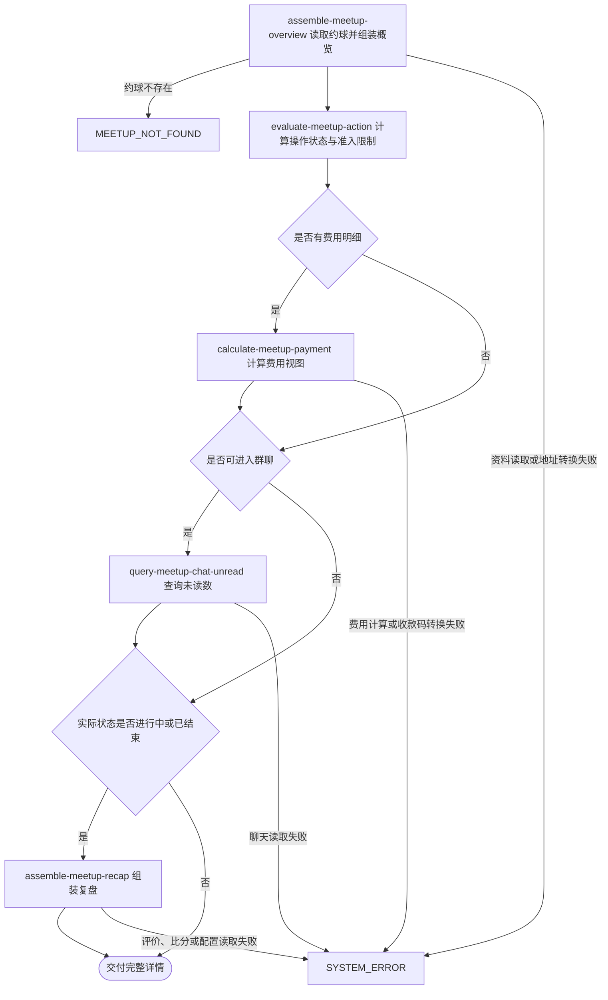

## 概要

按当前用户视角交付约球资料、参与状态、费用、未读与复盘。

## 触发

已登录用户从约球列表、个人页面或分享链接进入详情时发起。一次请求读取一个约球的完整当前视图；除登录和约球存在外没有访问限制。查询不修改约球、报名、群聊已读、比分、评价或支付数据。

## 接口契约

### 请求参数

| 字段 | 类型 | 必填 | 约束 |
|---|---|---|---|
| `meetupId` | 路径字符串 | 是 | 目标约球编号 |
| `shareUserId` | 查询字符串 | 否 | 当前仅记录日志，不影响权限、归因和响应 |

### 成功响应

| 字段 | 类型 | 说明 |
|---|---|---|
| `meetup` | 对象 | 基本资料、人数、城市、时间、场地、准入条件、存储状态与背景图 |
| `creator` | 对象 | 发布者编号、昵称、头像、性别、NTRP 与历史发布次数 |
| `participants` | 对象 | 当前用户角色与按视角筛选的报名参与者列表 |
| `weather` | 对象 | 按场地位置和上海时区口径计算的日出、日落 |
| `actionState` | 枚举 | 按当前时间、用户角色、报名和评价计算的操作状态 |
| `joinable` | 布尔值或空值 | 仅可直接报名或可申请时交付 |
| `restrictions` | 枚举列表或空值 | 满员、性别、水平、信誉及资料完整度限制，可叠加 |
| `payment` | 对象或空值 | 有费用明细时交付角色、总额、计算人数、分摊和收款码 |
| `unreadCount` | 整数或空值 | 当前用户可进入群聊时交付，不推进已读位置 |
| `recap` | 对象或空值 | 实际进行中或已结束时交付可评价人、本人评价、比分及默认标签 |

## 业务活动

- assemble-meetup-overview  组装约球、天气、发布者与按当前视角筛选的参与者资料
- evaluate-meetup-action  计算当前操作状态，并在可报名时汇总全部准入限制
- calculate-meetup-payment  有费用时计算角色、人数、本人分摊金额及收款码视图
- query-meetup-chat-unread  对可进入群聊的当前用户查询未读数但不推进已读
- assemble-meetup-recap  对进行中或已结束约球组装评价、比分和默认标签

## 流程图

## 详细流程

1. 识别当前登录用户，接收约球编号和可选分享用户编号；分享用户编号只记录日志，不参与权限、归因或响应组装。
2. 读取约球及全部报名记录；按当前时间计算实际状态，同时保留并交付约球存储状态。
3. 创建者视角选取待审核和有效报名，其他用户只选取有效报名；批量读取这些报名用户和创建者资料。
4. 组装基本资料、场地背景、固定上海时区口径的日出日落、创建者资料及发布次数、参与者资料和球友等级。
5. 结合实际状态、当前用户角色、报名和评价情况计算操作状态；仅操作状态为可直接报名或可申请时，读取本人资料并汇总全部报名限制。
6. 有费用明细时汇总总额、识别收款人/付款人/陌生人角色，按实际状态确定计算人数，再计算人均或按人时的本人金额及说明；发布者存在收款码时对所有角色交付签名地址。
7. 当前用户可进入群聊时查询未读数；没有聊天成员记录时把该约球全部已有消息计为未读，不推进已读位置。
8. 实际状态为进行中或已结束时，查询本人评价、可评价球友、全部比分和默认标签，组装复盘；其他状态不交付复盘。
9. 汇总约球、创建者、参与者、操作状态、可选报名限制、天气、费用、未读数和复盘后同步交付。

## 异常分支

| 对外失败码 | 触发条件 | 由哪个活动报出 | 补偿动作或超时处理 | 对外提示 |
|---|---|---|---|---|
| `MEETUP_NOT_FOUND` | 目标约球不存在 | assemble-meetup-overview | 只读查询，无需补偿 | 约球不存在 |
| `TOKEN_INVALID` / `TOKEN_EXPIRED` | 登录凭证无效或过期 | 流程 | 不读取详情，不修改数据 | 登录凭证无效或登录已过期，请重新登录 |
| `SYSTEM_ERROR` | 约球、用户、扩展资料、聊天、评价、比分或配置读取失败，费用数据无法计算，或七牛云地址转换失败 | 各活动 | 只读查询，无业务对象需要恢复 | 系统异常，请稍后重试 |

参与者用户资料缺失时仍保留报名编号、用户编号、状态与申请时间，展示资料为空；发布者资料缺失时当前组装性别会失败并终止查询。没有费用、不可进入群聊或尚未进行时，对应 `payment`、`unreadCount` 或 `recap` 为空。人时方案未包含当前用户时本人金额为零、说明为空。

## 技术线索

- 表 `meetup`、报名记录：基本资料、存储状态、参与者视角和实际状态
- 表 `user`、网球档案及用户扩展资料：发布者/参与者展示、准入判断、球友等级和收款码
- 表 `chat_user`、`chat_message`：详情未读数，只读不推进位置
- 评价与比分记录：本人评价、可评价用户和按盘比分
- 系统配置：编辑锁定分钟、准入阈值、默认评价标签及球友等级参数
- 外部能力：七牛云签名地址；场地背景与日出日落计算
