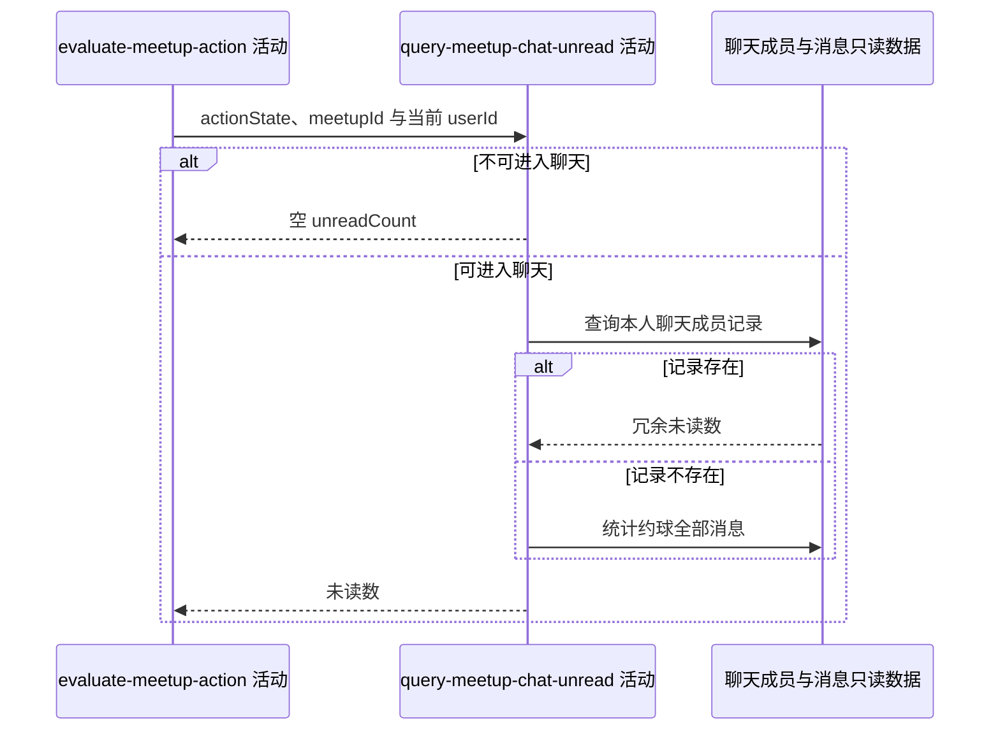

## 概要

查询可进入群聊用户的未读数且不推进已读。

## 时序图

## 触发条件

操作状态计算完成后，仅当前用户可进入该约球群聊时执行查询。

## 活动契约

### 入参

| 字段 | 类型 | 必填 | 约束 |
|---|---|---|---|
| `meetupId` | 字符串 | 是 | 目标聊天关联编号 |
| `currentUserId` | 字符串 | 是 | 当前登录用户编号 |
| `actionState` | 枚举 | 是 | 用于判断是否可进入聊天 |

### 成功返回

| 字段 | 类型 | 必填 | 说明 |
|---|---|---|---|
| `unreadCount` | 整数 | 否 | 可聊天时为非负数；不可聊天时为空 |

## 异常分支

| 错误标识 | 触发条件 | 来源 |
|---|---|---|
| `SYSTEM_ERROR` | 聊天成员或消息数量读取失败 | get-meetup-detail 流程 `SYSTEM_ERROR` 一行 |

## 领域依赖

无

## 业务动作

A1 判断当前操作状态是否允许进入群聊
A2 查询本人聊天成员冗余未读数
A3 无成员记录时统计约球全部已有消息
A4 返回未读数而不改变阅读状态

## 详细流程

1. `A1` 仅 `JOINED`、`ONGOING_JOINED`、`OWNER_EDITABLE`、`OWNER_EDIT_LOCKED`、`FINISHED_JOINED`、`FINISHED_REVIEWED`、`CLOSED_JOINED` 可查询；其他状态返回空。
2. `A2` 按 `ref_id=meetupId`、`user_id=currentUserId` 查聊天成员，存在时直接返回 `unread_count`。
3. `A3` 没有成员记录时统计该 `ref_id` 的全部消息条数；没有消息返回 0。
4. `A4` 不建立聊天成员，不更新已读消息、时间或未读冗余数。

## 边界情况

- 有聊天资格但从未打开聊天时，全部已有消息均计未读。
- 查询期间并发发送可能使结果是近似时点值，不加一致性锁。
- 已有成员记录的冗余未读数即使短暂不一致也不现场重算。
- 不可聊天用户不访问聊天表。

## 实现提示

保持详情查询无副作用；已读推进只允许在明确的消息拉取活动发生。
