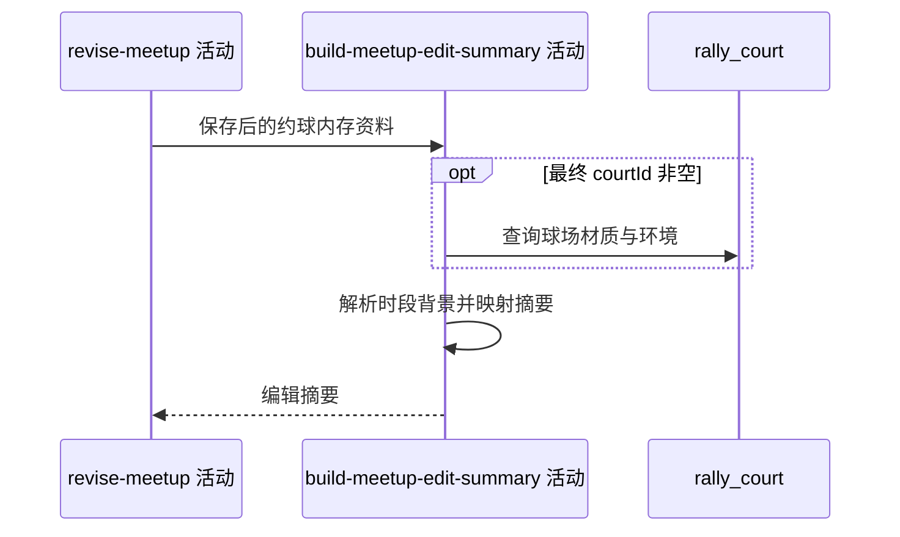

## 概要

按保存后内存资料形成背景与约球编辑摘要。

## 时序图

## 触发条件

同服务上游完成约球保存后、事务尚未结束时执行。

## 活动契约

### 入参

| 字段 | 类型 | 必填 | 约束 |
|---|---|---|---|
| `savedMeetup` | 约球资料 | 是 | 上游更新后的同一内存对象 |

### 成功返回

| 字段 | 类型 | 必填 | 说明 |
|---|---|---|---|
| `summary` | 编辑摘要 | 是 | 基本编辑字段、状态、创建时间和背景；不含参与者、操作状态、复盘或人时分摊 |

## 异常分支

| 错误标识 | 触发条件 | 来源 |
|---|---|---|
| `SYSTEM_ERROR` | 摘要映射、球场读取或背景解析失败 | edit-meetup 流程 `SYSTEM_ERROR` 一行 |

## 领域依赖

无

## 业务动作

A1 从保存后内存对象映射编辑摘要字段
A2 按最终球场资料和开始时段解析展示背景
A3 返回完整编辑摘要

## 详细流程

1. `A1` 直接使用上游同一 `MeetupData`，因此若球场映射已覆盖编号、城市名或创建时间，摘要也展示覆盖值。
2. 映射约球编号、发布者、标题、形式、人数、城市区县、起止时间、时长、场地、NTRP、性别、加入方式、费用项、存储状态和创建时间。
3. 不返回参与者、操作状态、复盘、人时分摊、通知授权或区县编码。
4. `A2` 最终 `courtId` 非空时查球场材质与室内外；缺失时以空材质环境降级。天气固定按晴天。
5. 背景时段按开始时间：17:00–19:00 黄昏，19:00–次日 06:00 夜间，其余白天，再返回背景键。
6. 本活动不写库、不缓存；但仍处在编辑事务调用链内，异常时报 `SYSTEM_ERROR` 并触发上游事务回滚。

## 边界情况

- 球场记录不存在仍可使用默认背景。
- 开始时间缺失会使背景或摘要计算失败，但接口必填校验通常先拦截。
- 摘要成功不证明原 meetupId 对应数据库行确实被更新，映射缺陷可能改变保存目标。
- 不发送编辑通知。

## 实现提示

保持摘要只读；背景规则统一复用卡片解析器，避免详情与编辑响应产生不同时段口径。
