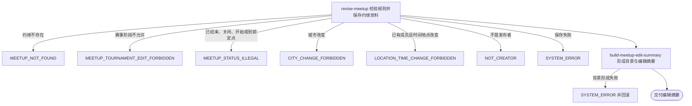

## 概要

由发布者在锁定前修订约球资料并交付编辑摘要。

## 触发

约球发布者在活动编辑锁定点之前提交修改时发起，调用方是登录用户端。一次请求处理一个既有普通约球或尚未完成确认的赛事约球；重复提交没有版本号或幂等键，后到请求按其读取时状态再次校验并覆盖可编辑资料。

## 接口契约

### 请求参数

| 字段 | 类型 | 必填 | 约束 |
|---|---|---|---|
| `meetupId` | 字符串 | 是 | 不可为空白，目标约球编号 |
| `title` | 字符串 | 否 | 最多 128 字符；空值保留原值 |
| `matchType` | 枚举 | 是 | 单打、双打或拉球 |
| `maxPlayers` | 整数 | 是 | 2 至 16；当前可低于已有参与人数 |
| `startTime` | 日期时间 | 是 | 当前不校验必须在未来 |
| `duration` | 小数 | 是 | 单位小时；当前没有正数、范围或步长校验 |
| `courtName` | 字符串 | 否 | 最多 128 字符 |
| `courtAddress` | 字符串 | 是 | 不可为空白，最多 256 字符 |
| `courtSelectMode` | 枚举 | 否 | `TEXT`、`MAP` 或 `FREE` |
| `courtId` | 字符串 | 否 | `TEXT`/`MAP` 命中时采用球场库资料 |
| `cityCode` | 字符串 | 是 | 不可为空白且必须等于原约球城市编码 |
| `districtCode` | 字符串 | 否 | 当前接收但不保存 |
| `courtLng` / `courtLat` | 小数 | 是 | 经度 -180 至 180，纬度 -90 至 90 |
| `levelMode` | 枚举 | 是 | 区间、精确值、不低于或不高于 |
| `levelMin` / `levelMax` | 小数 | 否 | 单值如提供须在 1.5 至 7.0；不校验模式组合、顺序和 0.5 步长 |
| `genderLimit` | 枚举 | 是 | 性别限制 |
| `joinMode` | 枚举 | 是 | 直接加入或审批加入 |
| `costItems` | 费用项列表 | 否 | 空值保留原明细，空列表清空；费用项内容不校验 |
| `courtIndex` | 字符串 | 否 | 非空值透传保存 |
| `acceptedNoticeScenes` | 字符串列表 | 否 | 当前不产生通知授权或保存结果 |

### 成功响应

交付编辑后的约球摘要，包括约球编号、发布者、标题、活动形式、人数、城市与区县、开始和结束时间、持续时长、场地、背景、NTRP 与性别限制、加入方式、费用明细、存储状态和创建时间；不包含参与者、操作状态、复盘或分摊详情。

## 业务活动

- revise-meetup  校验编辑资格和锁定规则，解析场地并保存允许修改的约球资料
- build-meetup-edit-summary  按保存后的资料解析展示背景并组装编辑摘要

## 流程图

## 详细流程

1. 接收约球编号及完整编辑字段，识别当前登录用户并读取约球、报名记录。
2. 若为赛事约球，先确认关联比赛存在且处于订场中或已排期；随后按实际状态与配置的提前分钟数确认尚未结束、关闭或到达编辑锁定点。
3. 确认请求城市编码与原约球相同；除发布者外已有有效参与者时，确认请求中的开始时间、持续时长、场地名称、地址和经纬度均未变化。
4. 在上述规则之后确认当前用户是约球发布者；非发布者不会修改约球，但可能先收到更早规则的失败结果。
5. 场地选择方式为文字搜索或地图选择且提供球场编号时查询球场；找到后采用球场库名称、地址、坐标和区县，找不到时采用请求资料并从地址识别区县。
6. 更新标题、活动形式、人数上限、时间、场地、准入条件、加入方式、费用明细和场地索引，按新开始时间与持续时长重算结束时间；不改变约球状态和报名。
7. 请求费用明细为空值时保留原值，空列表时清空；按人时分摊、通知授权和区县编码不在本次编辑保存范围内。
8. 若采用球场库数据，当前映射还会把球场编号、城市名、创建时间和更新时间写入约球对象；保存可能以球场编号作为目标，原约球不一定被更新。
9. 保存成功后按最终场地、环境和开始时段形成背景，交付编辑后的约球摘要；背景形成失败时事务回滚本次保存。

## 异常分支

| 对外失败码 | 触发条件 | 由哪个活动报出 | 补偿动作或超时处理 | 对外提示 |
|---|---|---|---|---|
| 请求校验失败 | 必填、长度、人数、经纬度或 NTRP 单值范围不符合约束 | 流程 | 未进入编辑事务 | 对应字段校验提示 |
| `MEETUP_NOT_FOUND` | 约球编号不存在 | revise-meetup | 不修改约球 | 约球不存在 |
| `MEETUP_TOURNAMENT_EDIT_FORBIDDEN` | 赛事约球无关联比赛，或比赛不是 `BOOKING`、`SCHEDULED` | revise-meetup | 不修改约球和比赛 | 双方已确认赛约，赛事信息无法修改 |
| `MEETUP_STATUS_ILLEGAL` | 实际已结束、已关闭、已开始或当前时间不早于锁定点 | revise-meetup | 不修改约球 | 约球状态不允许该操作 |
| `CITY_CHANGE_FORBIDDEN` | 请求城市编码不同于原值 | revise-meetup | 不修改约球 | 已发布的约球不可修改城市 |
| `LOCATION_TIME_CHANGE_FORBIDDEN` | 有其他有效参与者时修改开始时间、持续时长、场地名称、地址或坐标 | revise-meetup | 不修改约球 | 已有参与者报名，不可修改时间、地点、持续时长 |
| `NOT_CREATOR` | 当前用户不是发布者且更早规则均通过 | revise-meetup | 不修改约球 | 仅发布者可操作 |
| `SYSTEM_ERROR` | 约球、报名、赛事比赛、球场或配置读取失败，保存失败，或背景形成失败 | revise-meetup / build-meetup-edit-summary | 事务回滚；但命中球场库时保存目标可能因约球编号被覆盖而不是原约球 | 系统异常，请稍后重试 |

`TEXT`、`MAP` 指定的球场不存在时不会失败，而是降级采用请求场地。命中球场库时，当前实现会连同球场编号、城市名及球场创建/更新时间覆盖约球相应字段；保存可能作用于球场编号对应记录，接口交付的约球编号也随之变化。

## 技术线索

- HTTP 接口：`POST /meetup/edit`
- `rally_meetup.biz_id`、`city_name`、`createTime` 可能被球场资料覆盖
- 赛事比赛状态：`BOOKING`、`SCHEDULED`
- 配置：约球编辑锁定提前分钟数，默认 60 分钟
- 场地背景：17:00 至 19:00 为黄昏，19:00 至次日 06:00 为夜晚，天气按晴天降级
