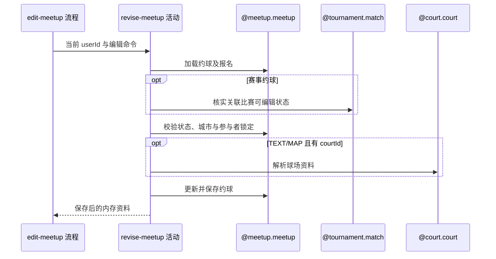

## 概要

校验编辑锁定规则并保存约球可编辑资料。

## 时序图

## 触发条件

已登录用户提交通过接口字段校验的约球编辑命令后执行；普通约球与部分赛事约球均可进入。

## 活动契约

### 入参

| 字段 | 类型 | 必填 | 约束 |
|---|---|---|---|
| `operatorId` | 字符串 | 是 | 最终须为发布者 |
| `meetupId` | 字符串 | 是 | 非空白 |
| `editData` | 编辑资料 | 是 | 含活动形式、人数、时间、场地、准入、加入方式、可选费用和场地索引；约束沿用 flow 契约 |

### 成功返回

| 字段 | 类型 | 必填 | 说明 |
|---|---|---|---|
| `savedMeetup` | 约球资料 | 是 | 映射并尝试保存后的同一内存对象，供摘要活动使用 |

## 异常分支

| 错误标识 | 触发条件 | 来源 |
|---|---|---|
| `MEETUP_NOT_FOUND` | 约球不存在 | edit-meetup 流程 `MEETUP_NOT_FOUND` 一行 |
| `MEETUP_TOURNAMENT_EDIT_FORBIDDEN` | 赛事约球无关联比赛或比赛非 `BOOKING/SCHEDULED` | edit-meetup 流程 `MEETUP_TOURNAMENT_EDIT_FORBIDDEN` 一行 |
| `MEETUP_STATUS_ILLEGAL` | 实际状态、开始时间或编辑锁定点不允许 | edit-meetup 流程 `MEETUP_STATUS_ILLEGAL` 一行 |
| `CITY_CHANGE_FORBIDDEN` | 请求城市不同于原城市 | edit-meetup 流程 `CITY_CHANGE_FORBIDDEN` 一行 |
| `LOCATION_TIME_CHANGE_FORBIDDEN` | 有其他已批准成员时修改时间或地点 | edit-meetup 流程 `LOCATION_TIME_CHANGE_FORBIDDEN` 一行 |
| `NOT_CREATOR` | 更早规则通过后操作人不是发布者 | edit-meetup 流程 `NOT_CREATOR` 一行 |
| `SYSTEM_ERROR` | 约球、报名、比赛、球场、配置读取或保存失败 | edit-meetup 流程 `SYSTEM_ERROR` 一行 |

## 领域依赖

### @meetup.meetup

- 输入：约球编号、操作人、完整编辑资料，以及按实际状态、锁定点、城市和参与者判断并更新的意图
- 输出：校验通过时保存允许修改的资料并返回当前内存视图；不存在、无权、状态或变更不允许、保存失败时返回相应结论

### @tournament.match

- 输入：赛事约球编号与核实关联比赛仍允许编辑的意图
- 输出：关联比赛存在且状态为 `BOOKING` 或 `SCHEDULED` 时允许继续；否则返回不可编辑结论

### @court.court

- 输入：`TEXT/MAP` 场地选择模式下的球场编号
- 输出：命中时返回球场名称、地址、坐标、区县、城市与时间字段；未命中时返回空结果供活动降级请求资料

## 业务动作

A1 加载约球并按赛事类型核实关联比赛状态
A2 按实际状态、锁定配置、城市和参与者校验变更
A3 确认操作人为发布者并解析可选球场库资料
A4 映射允许修改的字段并重算结束时间
A5 保存约球并返回更新后的内存资料

## 详细流程

1. `A1` 赛事约球先按 meetupId 找比赛，仅 `BOOKING/SCHEDULED` 继续；普通约球跳过。
2. `A2` 读取编辑锁定分钟，要求约球未结束、关闭、开始且当前时间早于锁定点；城市编码必须保持原值。
3. 已批准参与人数大于 1 时，开始时间、持续时长、场地名称、地址或经纬度任一变化均拒绝；`courtId/courtSelectMode` 本身不比较。
4. 上述规则均通过后 `A3` 才核实发布者，因此非创建者可能先得到更早业务错误。
5. `TEXT/MAP` 且 `courtId` 非空时查球场，命中采用库内名称、地址、坐标与区县；未命中或 `FREE` 使用请求资料并从地址识别区县。
6. `A4` null 字段通常保留原值；费用项 null 保留、空列表清空。`districtCode` 与人时分摊不在保存范围。
7. 用开始时间和 duration 重算结束时间，不校验 duration 正数或步长；状态和报名不变。
8. 当前生成映射在命中球场时还会把约球 `bizId/cityName/createTime/updateTime` 覆盖为球场值，`A5` 随后可能按被覆盖编号更新错误目标；文档保留这一真实缺陷。
9. 整个调用在应用事务内，保存失败回滚。

## 边界情况

- 人数上限可以降到低于现有参与人数。
- 开始时间可改到过去，但实际状态与锁定校验通常可能先拒绝。
- NTRP 模式组合、上下界顺序及 0.5 步长不校验。
- 命中球场映射缺陷可能导致原约球未更新或唯一键/目标更新异常。
- 无版本号，并发编辑按各自读取状态校验后最后写入生效。

## 实现提示

实现阶段应优先审计球场多源映射覆盖 `bizId` 等字段的问题；本轮仅记录，不修改 Java。
