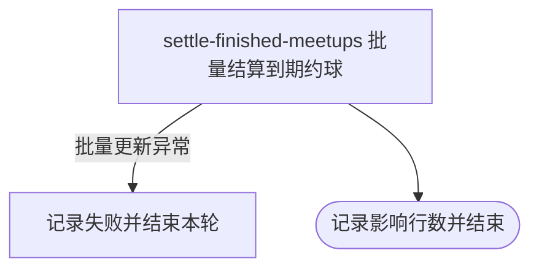

## 概要

每日批量将已过结束时间的开放约球结算为已结束。

## 触发

约球状态定时任务在 `job.meetup.enabled=true` 时注册，由调度器按 `job.meetup.status.cron` 触发，默认每天凌晨 2 点执行。一次处理数据库中当时全部符合条件的约球，不分页、不限量；重复执行是幂等的，已转为 `FINISHED` 的记录不会再次命中。

## 接口契约

### 请求参数

无。

### 成功响应

无对外响应；任务日志记录本次更新的约球数量。

## 业务活动

- settle-finished-meetups  按状态和结束时间批量把符合条件的约球置为已结束

## 流程图

## 详细流程

1. 仅在约球任务开关启用时，按配置的定时表达式触发；默认每天凌晨 2 点执行一次。
2. 以执行批量更新时的当前时间为结算基准，不预先分页或固定批次上限。
3. 一次选中存储状态严格为大写 `OPEN` 或小写 `full`，且结束时间早于结算基准的全部约球；普通和赛事约球使用同一条件。
4. 用一条批量更新把所有命中约球的存储状态设为 `FINISHED`；`ONGOING`、大写 `FULL`、已关闭和其他状态不处理。
5. 记录本次影响行数；没有命中记录时以零条正常结束。
6. 任一异常由任务捕获并记录，不向用户返回结果，也不在本轮内重试；仍符合条件的记录等待下次调度。

## 异常分支

| 对外失败码 | 触发条件 | 由哪个活动报出 | 补偿动作或超时处理 | 对外提示 |
|---|---|---|---|---|
| 无 | 没有状态为 `OPEN` 或 `full` 且结束时间已过的约球 | settle-finished-meetups | 以影响零条正常结束 | 无 |
| 无 | 批量更新过程发生异常 | settle-finished-meetups | 捕获并记录异常，本轮不重试；未结算记录留待下一次调度 | 无 |

这是单条批量更新而非逐条处理，不提供逐对象成功失败统计。`ONGOING` 与大写 `FULL` 即使已经超过结束时间也不会命中；任务关闭时不会执行任何补扫。

## 技术线索

- 定时任务：`updateFinishedStatus`
- 开关：`job.meetup.enabled`
- 调度：`job.meetup.status.cron`，默认 `0 0 2 * * ?`
- 状态条件：`OPEN`、`full`；目标状态 `FINISHED`
- 时间条件：`end_time` 早于执行时刻
