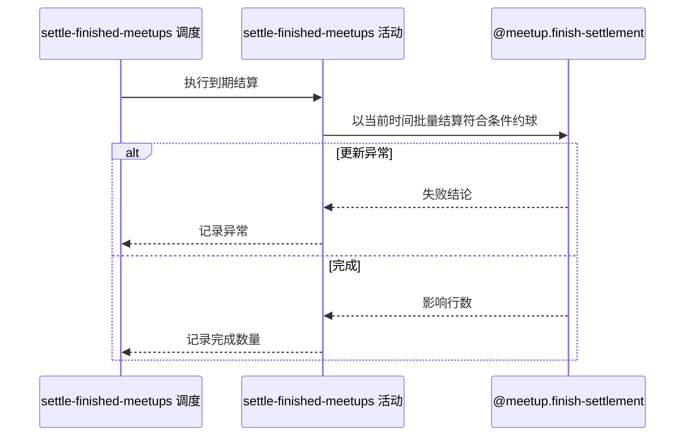

## 概要

批量把已过结束时间的指定状态约球置为结束。

## 时序图

## 触发条件

约球任务开关启用时按配置 cron 触发，默认每天凌晨 2 点；没有请求参数。

## 活动契约

### 入参

无。

### 成功返回

| 字段 | 类型 | 必填 | 说明 |
|---|---|---|---|
| `affectedCount` | 整数 | 是 | 本次由一条批量更新改为 `FINISHED` 的记录数，可为 0 |

## 异常分支

无对外业务错误。批量更新失败由调度入口捕获并记录，本轮结束。

## 领域依赖

### @meetup.finish-settlement

- 输入：执行时当前日期时间，以及批量结算存储状态为 `OPEN` 或 `full` 且结束时间已过的约球意图
- 输出：单条批量更新把所有命中记录置为 `FINISHED` 并返回影响行数；更新异常时返回失败结论供任务记录

## 业务动作

A1 在执行更新时取得当前时间结算基准
A2 批量筛选指定存储状态且结束时间早于基准的约球
A3 用单条更新置为 FINISHED 并返回影响行数

## 详细流程

1. `A1` 使用运行环境 `LocalDateTime.now()`，在构造批量更新时取值，不预先冻结分页清单。
2. `A2` 精确匹配存储状态字符串 `OPEN` 或 `full`，并要求 `end_time < 基准`；不区分普通和赛事约球。
3. `ONGOING`、大写 `FULL`、关闭及其他状态不命中，结束时间恰等于基准也不命中。
4. `A3` 由一条数据库 UPDATE 把全部命中记录设为大写 `FINISHED`，返回影响行数用于日志。
5. 异常由调度入口捕获，不在本轮重试、不产出逐对象结果；仍符合条件的记录等待下次调度。

## 边界情况

- 没有命中记录时返回 0 并正常结束。
- 已结算记录不会再次匹配，重复调度幂等。
- 任务关闭期间不补扫，重新启用后的下一次执行统一处理积压。
- 单条批量语句内原子，但不提供逐记录成功失败统计。

## 实现提示

保留状态字符串大小写的真实兼容口径；若统一枚举值，应先修订 flow 与历史数据迁移方案。
