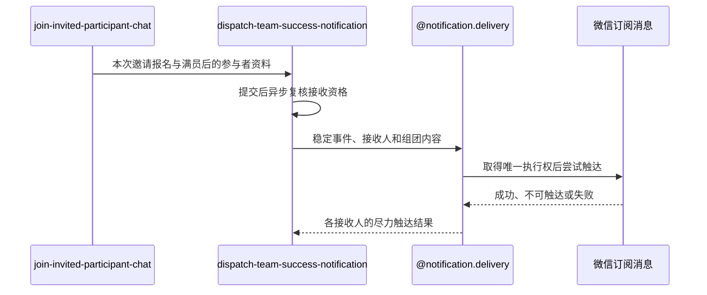

## 概要

邀请使约球满员后尽力通知全部有效参与者。

## 时序图

## 触发条件

邀请报名、约球当前人数和群聊成员已在同一事务提交，且邀请后 `currentPlayers>=maxPlayers`。

## 活动契约

### 入参

| 字段 | 类型 | 必填 | 约束 |
|---|---|---|---|
| `registrationId` | 字符串 | 是 | 本次邀请新建的报名编号，用于构造稳定事件 |
| `meetupId` | 字符串 | 是 | 本次达到满员条件的约球编号 |
| `participantUserIds` | 字符串列表 | 是 | 邀请提交时全部有效参与者，可为空 |
| `tournamentName` | 字符串 | 否 | 赛事语义存在时用于通知展示 |
| `meetupName` | 字符串 | 是 | 通知展示的活动名称 |
| `startTime` | 日期时间 | 是 | 通知展示的活动开始时间 |
| `courtName` | 字符串 | 是 | 通知展示的活动地点 |

### 成功返回

无业务数据；成功只表示已安排组团成功尽力触达，不表示任何参与者已经收到消息。

## 异常分支

无。接收资格变化、重复事件、渠道不可达、触达日志或微信异常均在活动内跳过或记录，不改变邀请结果。

## 领域依赖

### @notification.delivery

- 输入：由本次报名编号构造的 `TEAM_SUCCESS` 稳定事件、约球业务上下文、复核后的有效参与者、语义化组团内容和微信订阅渠道。
- 输出：每个接收人与渠道取得唯一执行权后形成成功、失败或预期跳过的触达结果，重复任务不再次发送；异常时不向邀请流程传播失败，保留可审计结果或应用日志。

## 业务动作

- A1 确认本次邀请使约球达到或超过人数上限。
- A2 在邀请事务提交后把通知任务交给异步执行。
- A3 去重候选参与者并逐人复核其报名仍然有效。
- A4 以本次邀请报名编号构造 `TEAM_SUCCESS` 稳定事件和组团内容。
- A5 委托 `@notification.delivery` 取得微信触达执行权并尝试发送，接受各接收人的触达结果。

## 详细流程

1. A1 邀请后仍未满员时正常结束，不向被邀请人单独发送邀请成功通知。
2. A2 仅在报名、人数和群聊成员事务成功提交后进入线程池；事务回滚时不启动通知。
3. A3 候选是提交时全部有效参与者；发送前报名已退出者跳过，复核异常按仍可触达继续。
4. A4 同一次邀请始终使用同一报名事件；成员变化后另一报名再次使约球满员时形成新事件。
5. A5 每个接收人只有唯一触达日志首次创建成功才调用微信；缺少接收身份或未订阅时接受预期跳过，其他渠道错误接受失败。

## 边界情况

- 候选为空或全部候选已退出时正常结束。
- 同一邀请任务重复执行时由事件、接收人和渠道唯一约束跳过。
- 触达日志创建、渠道调用或结果回写失败均不影响已提交的邀请、报名和群聊成员。
- 进程中断可能留下 `SENDING` 触达日志；当前不自动重试。

## 实现提示

无
