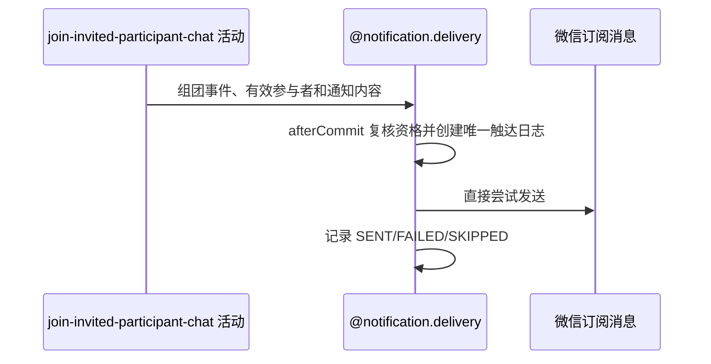

## 概要

邀请使约球满员并提交后，以本次邀请报名编号构造 `TEAM_SUCCESS` 事件，异步尝试触达全部有效参与者。

## 时序图

## 详细流程

1. 只有邀请后 `currentPlayers>=maxPlayers` 才触发，候选是当时全部有效参与者。
2. 发送前复核候选人仍是约球成员；明确退出者跳过，复核异常 fail-open。
3. 每个接收人和渠道只有首次创建触达日志成功才发送；重复执行同一次邀请会被跳过，成员变更后由新报名再次使约球满员时则是新事件。
4. 未订阅或缺少 openid 记 `SKIPPED`，其他渠道错误记 `FAILED`，成功记 `SENT`。

## 边界情况

触达日志创建、渠道调用或结果回写失败均不影响已提交的邀请、报名和群聊成员。
