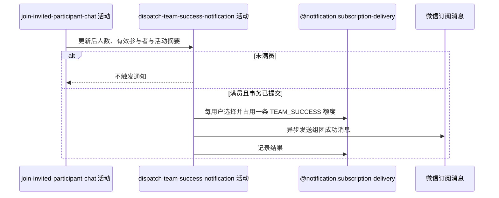

## 概要

满员提交后异步发送组团成功订阅通知。

## 时序图

## 触发条件

报名与群聊成员事务将提交且邀请后 `currentPlayers >= maxPlayers` 时登记提交后异步通知；未满员不执行。

## 活动契约

### 入参

| 字段 | 类型 | 必填 | 约束 |
|---|---|---|---|
| `meetupId` | 字符串 | 是 | 已完成邀请的约球编号 |
| `participantIds` | 用户编号列表 | 是 | 当时全部 `JOINED/REVIEWED/SKIPPED` 参与者 |
| `noticeData` | 约球摘要 | 是 | TEAM_SUCCESS 模板所需活动数据 |
| `isFull` | 布尔值 | 是 | 仅 true 时触发 |

### 成功返回

无业务数据；异步尽力发送，不表示所有参与者已收到。

## 异常分支

无。额度、资格、渠道、发送与回写失败只记录，不改变邀请结果。

## 领域依赖

### @notification.subscription-delivery

- 输入：业务类型 `MEETUP`、约球编号、场景 `TEAM_SUCCESS`、全部有效参与者及每人消费一条可用额度的意图
- 输出：每位候选至多处理一条额度并记录发送结果；无额度、资格变化、并发占用或通知异常时返回跳过/失败结论且不影响邀请

## 业务动作

A1 判断邀请后是否达到或超过人数上限
A2 在事务提交后异步查询每位参与者首条可用额度
A3 复核成员资格并原子占用额度
A4 发送组团成功通知并记录结果

## 详细流程

1. `A1` 使用聚合更新后 `currentPlayers >= maxPlayers`；未满员不发送被邀请成功通知或其他通知。
2. 满员时候选为全部 `JOINED/REVIEWED/SKIPPED` 参与者，通常包括创建者报名和新被邀请人。
3. `A2` 仅在核心事务成功提交后异步查询 `MEETUP/meetupId/TEAM_SUCCESS/UNUSED`，每个用户处理第一条。
4. `A3` 发送前复核仍可通知；明确退出则保留额度并跳过，复核异常 fail-open；CAS 到 `SENDING` 失败跳过。
5. `A4` 通过微信模板发送活动摘要，回写 `SENT/FAILED`；渠道、身份、发送或回写异常只记录。
6. 接口不等待异步结果，任何通知失败不回滚报名或群聊成员。

## 边界情况

- 没有可用额度时所有候选均不发送。
- 同一业务后续再次满足满员条件可能再次触发并消费另一条额度。
- 无通知级幂等键或持久化重试队列。
- 提交前事务回滚时不触发异步任务。

## 实现提示

微信 RPC snapshot 当前缺失；异步日志保留约球、场景、用户与额度流水标识，但不记录完整身份凭据。
