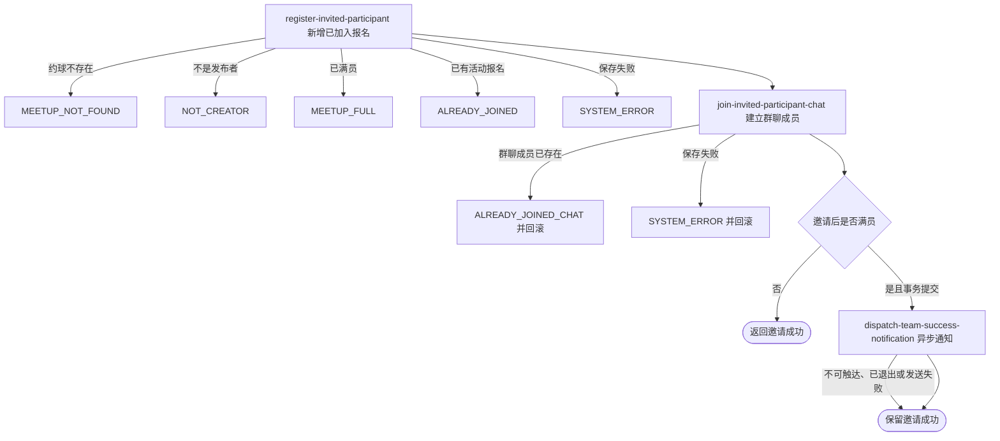

## 概要

由发布者邀请指定用户直接成为约球参与者与群聊成员。

## 触发

约球发布者指定一名用户直接加入本人约球时发起，调用方是登录用户端。一次请求邀请一个用户；没有请求幂等键，重复到达依靠活动报名和群聊成员检查拒绝，但并发请求没有名额或用户关系唯一性保护。

## 接口契约

### 请求参数

| 字段 | 类型 | 必填 | 约束 |
|---|---|---|---|
| `meetupId` | 字符串 | 是 | 不可为空白，目标约球编号 |
| `userId` | 字符串 | 是 | 不可为空白，被邀请用户编号；当前不验证账户存在 |

### 成功响应

无业务数据；成功表示报名和群聊成员关系已在同一事务提交，不表示组团成功通知已经送达。接口不交付报名编号或更新后人数。

## 业务活动

- register-invited-participant  校验发布者、名额和活动报名，新增已加入报名并重算当前人数
- join-invited-participant-chat  为被邀请人建立初始未读数为零的约球群聊成员关系

## 流程图

## 详细流程

1. 接收目标约球和被邀请用户编号，识别当前登录用户并读取约球及全部报名记录。
2. 确认当前用户是发布者，按发布者加有效报名人数确认尚未达到人数上限，并确认被邀请人没有待审核或有效报名。
3. 不读取或核对被邀请人账户、档案、性别、NTRP、信誉、时间冲突，也不限制约球状态、时间、加入方式或普通/赛事性质。
4. 新建一条状态为 `JOINED` 的报名，保留已拒绝、已撤回或已退出历史报名，并按全部有效报名重新计算约球当前人数。
5. 创建报名对象时由构造器生成雪花业务报名编号；聚合保存按该编号插入报名，但接口不向发布者返回编号。
6. 为被邀请人建立初始未读数为零的群聊成员记录；已有该群聊成员时拒绝，本次事务回滚刚建立的报名和人数。
7. 邀请后达到或超过人数上限时，在事务提交后向当时全部有效参与者异步尝试发送组团成功通知；未满员时不向被邀请人发送邀请成功通知。
8. 返回邀请成功，不交付报名、人数、群聊或通知结果；通知失败不改变邀请终态。

## 异常分支

| 对外失败码 | 触发条件 | 由哪个活动报出 | 补偿动作或超时处理 | 对外提示 |
|---|---|---|---|---|
| 请求校验失败 | `meetupId` 或 `userId` 为空白 | 流程 | 未读取或修改约球 | 对应约球ID或被邀请人用户ID不能为空 |
| `MEETUP_NOT_FOUND` | 目标约球不存在 | register-invited-participant | 不建立报名和群聊成员 | 约球不存在 |
| `NOT_CREATOR` | 当前用户不是约球发布者 | register-invited-participant | 不建立报名和群聊成员 | 仅发布者可操作 |
| `MEETUP_FULL` | 加载时有效人数已达到人数上限 | register-invited-participant | 不建立报名和群聊成员 | 约球已满员 |
| `ALREADY_JOINED` | 被邀请人已有 `PENDING`、`JOINED`、`REVIEWED` 或 `SKIPPED` 报名 | register-invited-participant | 保留原有关系，不新增报名 | 你已报名该约球 |
| `ALREADY_JOINED_CHAT` | 被邀请人已有该约球群聊成员记录 | join-invited-participant-chat | 整体事务回滚新报名和当前人数 | 你已加入该聊天 |
| `SYSTEM_ERROR` | 约球、报名、群聊成员读写或事务提交失败 | register-invited-participant / join-invited-participant-chat | 整体事务回滚本次报名、人数和群聊变更 | 系统异常，请稍后重试 |

并发邀请基于各自加载的旧人数和报名集合判断，可能突破人数上限或形成重复报名。组团通知微信不可触达、发送前已退出、接收身份缺失或微信发送失败时，只跳过或记录失败，不改变邀请结果；重复达到满员条件可能重复触发通知。

## 技术线索

- HTTP 接口：`POST /meetup/registration/invite`
- 报名表：`rally_meetup_registration`，新报名状态 `JOINED`
- 群聊成员：初始未读数为零
- 通知场景：`TEAM_SUCCESS`，事务提交后微信订阅消息
- 活动报名状态：`PENDING`、`JOINED`、`REVIEWED`、`SKIPPED`
