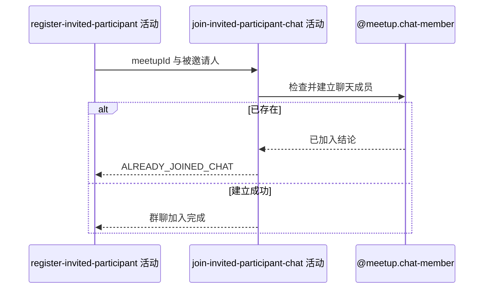

## 概要

为被邀请人建立未读数为零的群聊成员关系。

## 时序图

## 触发条件

同服务上游已新增邀请报名后、外层事务提交前执行。

## 活动契约

### 入参

| 字段 | 类型 | 必填 | 约束 |
|---|---|---|---|
| `meetupId` | 字符串 | 是 | 约球聊天关联编号 |
| `inviteeUserId` | 字符串 | 是 | 新报名被邀请人编号 |

### 成功返回

无业务数据；已建立初始聊天成员关系。

## 异常分支

| 错误标识 | 触发条件 | 来源 |
|---|---|---|
| `ALREADY_JOINED_CHAT` | 相同约球和用户已有聊天成员记录 | invite-meetup-participant 流程 `ALREADY_JOINED_CHAT` 一行 |
| `SYSTEM_ERROR` | 聊天成员读取、唯一冲突或保存失败 | invite-meetup-participant 流程 `SYSTEM_ERROR` 一行 |

## 领域依赖

### @meetup.chat-member

- 输入：约球编号、被邀请用户编号与建立新聊天成员的意图
- 输出：不存在相同关系时建立雪花编号、初始未读 0、当前加入时间的成员；已存在或保存失败时返回相应结论

## 业务动作

A1 检查约球与被邀请人的聊天成员关系是否存在
A2 建立初始未读数为零的新聊天成员
A3 确认群聊加入完成

## 详细流程

1. `A1` 按 `refId+userId` 检查；存在时拒绝，不按当前报名状态修复或复用。
2. `A2` 生成雪花业务编号，`unreadCount=0`、`joinedAt=当前时间`，已读消息编号与时间为空。
3. 不读取历史消息，因此邀请前已有消息不会进入初始未读数。
4. 已退出聊天的记录已被删除，可重新建立；并发建立由唯一键裁决，当前不自动按幂等成功处理。
5. `A3` 仍在邀请事务内，失败会回滚上游新报名、人数和本活动写入。

## 边界情况

- 先有聊天成员但无活跃报名时，本次邀请整体失败。
- 并发请求可能一个成功、另一个唯一冲突。
- 被邀请用户不存在不在本活动校验范围。
- 成功不推进到任何历史消息。

## 实现提示

成员唯一性继续由 `ref_id+user_id` 保证；避免在本活动把历史消息计为未读以外的新规则。
