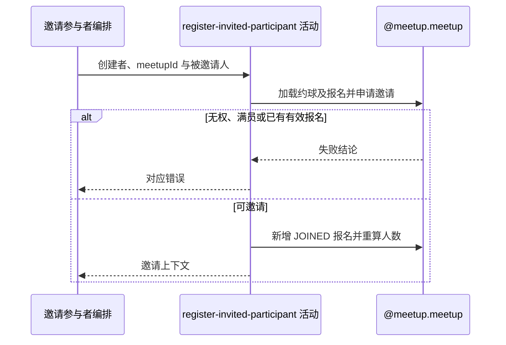

## 概要

校验邀请条件并新增已加入报名、重算人数。

## 时序图

## 触发条件

已登录用户提交非空约球编号和被邀请用户编号后执行；目标用户无需先授权或完善资料。

## 活动契约

### 入参

| 字段 | 类型 | 必填 | 约束 |
|---|---|---|---|
| `meetupId` | 字符串 | 是 | 非空白 |
| `inviterId` | 字符串 | 是 | 必须是约球创建者 |
| `inviteeUserId` | 字符串 | 是 | 非空白；不验证用户记录存在 |

### 成功返回

| 字段 | 类型 | 必填 | 说明 |
|---|---|---|---|
| `inviteContext` | 邀请上下文 | 是 | 约球编号、被邀请人、更新后有效参与者、人数上限与是否满员；不对外返回报名编号 |

## 异常分支

| 错误标识 | 触发条件 | 来源 |
|---|---|---|
| `MEETUP_NOT_FOUND` | 目标约球不存在 | invite-meetup-participant 流程 `MEETUP_NOT_FOUND` 一行 |
| `NOT_CREATOR` | 邀请人不是创建者 | invite-meetup-participant 流程 `NOT_CREATOR` 一行 |
| `MEETUP_FULL` | 加载时有效人数已达到上限 | invite-meetup-participant 流程 `MEETUP_FULL` 一行 |
| `ALREADY_JOINED` | 被邀请人已有待审核或有效报名 | invite-meetup-participant 流程 `ALREADY_JOINED` 一行 |
| `SYSTEM_ERROR` | 约球或报名读写、事务提交失败 | invite-meetup-participant 流程 `SYSTEM_ERROR` 一行 |

## 领域依赖

### @meetup.meetup

- 输入：约球编号、邀请人和被邀请人，以及校验创建者、容量、既有报名并直接邀请加入的意图
- 输出：允许时新增 `JOINED` 报名、按有效报名重算当前人数并返回邀请上下文；不存在、无权、满员、已报名或保存失败时返回相应结论

## 业务动作

A1 加载约球及全部报名并核实邀请人为创建者
A2 检查容量和被邀请人的待审核或有效报名
A3 新建 JOINED 报名并保留非活跃历史报名
A4 整体保存报名并重算约球当前人数
A5 返回群聊与满员通知所需上下文

## 详细流程

1. `A1-A2` 只检查创建者、是否已满及 `PENDING/JOINED/REVIEWED/SKIPPED` 报名。
2. 不检查约球状态、时间、类型、加入方式，也不查询被邀请人的用户、档案、性别、水平、信誉或时间冲突。
3. `A3` 构造报名时生成新雪花业务编号，状态直接为 `JOINED`；`REJECTED/WITHDRAWN/QUIT` 历史记录保留且不阻止新报名。
4. `A4` 以各报名业务编号 upsert 聚合内全部报名，并把 `currentPlayers` 重算为创建者加 `JOINED/REVIEWED/SKIPPED` 数量。
5. 本活动与后续群聊加入处在同一外层事务；群聊失败会回滚本次报名和人数。
6. `A5` 不向接口暴露报名编号，只交付后续上下文。

## 边界情况

- 串行重复邀请会因活跃报名被拒绝。
- 没有请求幂等键；并发邀请可基于旧人数与报名集合同时通过。
- 报名表缺少 meetup+user 唯一约束，并发可能形成重复报名并突破人数上限。
- 被邀请 userId 不存在也可能成功写入报名。

## 实现提示

若治理并发，应在聚合存储层同时约束容量和约球用户关系；本轮只记录现状。
