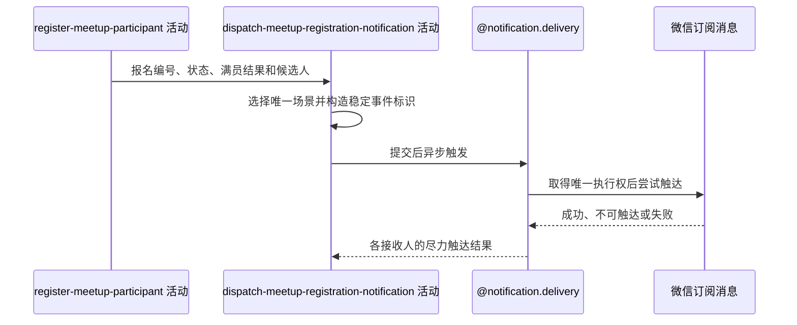

## 概要

按报名终态尽力发送报名、组团或待审批通知。

## 时序图

## 触发条件

报名及直接加入时的群聊成员变更即将提交后执行；每次成功报名恰好选择一个通知场景。

## 活动契约

### 入参

| 字段 | 类型 | 必填 | 约束 |
|---|---|---|---|
| `meetupId` | 字符串 | 是 | 本次报名所属约球编号 |
| `registrationId` | 字符串 | 是 | 本次新建报名编号，用于构造稳定事件 |
| `registrationStatus` | 枚举 | 是 | `JOINED` 或 `PENDING` |
| `fullAfterJoin` | 布尔 | 是 | 仅 `JOINED` 用于选择报名成功或组团成功 |
| `registrantId` | 字符串 | 是 | 报名人；未满员直接加入时的接收人 |
| `creatorId` | 字符串 | 是 | 约球发布者；待审批时的接收人 |
| `participantUserIds` | 字符串列表 | 是 | 满员时提交时点的全部有效参与者，可为空 |
| `messageContent` | 通知内容 | 是 | 对应场景的约球名称、时间、地点和提示内容 |

### 成功返回

无业务数据；成功只表示核心事务提交后已安排一种场景的尽力触达，不表示渠道已经送达。

## 异常分支

无。候选资格变化、重复事件、渠道不可达、触达日志或微信异常均在活动内跳过或记录，不改变报名结果。

## 领域依赖

### @notification.delivery

- 输入：由本次报名编号构造的稳定事件、约球业务上下文、唯一选定场景、候选接收人、语义化内容、可选成员过滤器和微信订阅渠道。
- 输出：每个接收人与渠道取得唯一执行权后形成成功、失败或预期跳过的触达结果，重复任务不再次发送；异常时不向报名流程传播失败，保留可审计结果或应用日志。

## 业务动作

- A1 按报名状态和直接加入后的满员结果选择唯一通知场景与接收人。
- A2 以本次报名编号构造稳定事件和对应场景的语义化内容。
- A3 在报名及可选群聊成员事务提交后把通知任务交给异步执行。
- A4 对需要成员资格的候选人去重并在发送前复核资格。
- A5 委托 `@notification.delivery` 取得微信触达执行权并尝试发送，接受各接收人的触达结果。

## 详细流程

1. A1 `JOINED` 且满员选择 `TEAM_SUCCESS`，候选为全部有效参与者；`JOINED` 且未满员选择 `JOIN_SUCCESS`，候选只有报名人；`PENDING` 选择 `PENDING_APPROVAL`，候选只有发布者。
2. A2 三种场景都使用本次报名编号形成稳定事件；同一报名不叠加发送多个场景。
3. A3 仅在报名、人数和直接加入时的群聊成员事务成功提交后进入线程池；事务回滚时不启动通知。
4. A4 组团和报名成功候选发送前复核有效成员资格，明确退出者不建日志，复核异常按仍可触达继续；待审批发布者不按报名资格过滤。
5. A5 只有唯一触达日志首次创建成功才调用微信；缺少接收身份或未订阅时接受预期跳过，其他渠道错误接受失败，结果回写异常只记应用日志。

## 边界情况

- 满员时不再发报名成功；待审批时不向报名人发消息。
- 同一报名事件重复触发时，触达唯一键阻止同接收人、同渠道重发。
- 未订阅、无接收身份、渠道失败或结果回写失败均不改变报名。
- 当前无持久化任务重试；进程中断可能留下 `SENDING`。

## 实现提示

无
