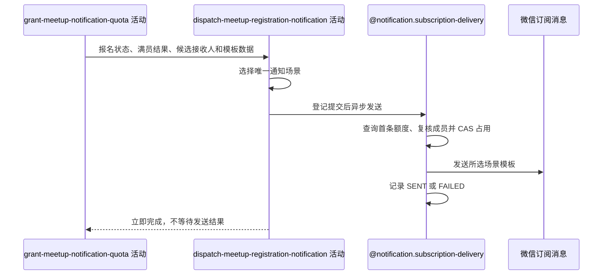

## 概要

按报名结果在事务提交后异步发送报名成功、组团成功或待审批通知。

## 时序图

## 触发条件

报名、直接加入时的群聊成员和已成功登记的授权额度即将提交后执行；每次成功报名恰好选择一个通知场景。

## 活动契约

### 入参

| 字段 | 类型 | 必填 | 约束 |
|---|---|---|---|
| `meetupId` | 字符串 | 是 | 本次报名约球编号 |
| `registrationStatus` | 枚举 | 是 | `JOINED` 或 `PENDING` |
| `teamFormed` | 布尔值 | 是 | 直接加入且更新后满员 |
| `applicantId` | 字符串 | 是 | 本次报名用户编号 |
| `creatorId` | 字符串 | 是 | 约球创建者编号 |
| `participantIds` | 用户编号列表 | 是 | 当时全部有效参与者 |
| `noticeData` | 通知摘要 | 是 | 活动名称、时间、地点、场地号及申请人昵称中的场景所需字段 |

### 成功返回

无业务数据；只表示异步发送已登记，不表示接收人获得通知。

## 异常分支

无。通知登记、额度查询、成员复核、并发占用、渠道发送与结果回写失败均只记录，不改变报名结果。

## 领域依赖

### @notification.subscription-delivery

- 输入：业务类型 `MEETUP`、约球编号、选定场景、候选接收人、模板数据，以及每位用户消费一条可用额度的意图
- 输出：提交后为每位候选至多处理一条额度并记录发送结果；无额度、资格变化、并发占用或通知异常时返回跳过/失败结论且不影响报名

## 业务动作

A1 按报名状态和满员结果选择场景与接收人
A2 在核心事务提交后异步查询每位候选的首条可用额度
A3 复核成员资格并原子占用额度
A4 发送通知并记录成功或失败结果

## 详细流程

1. `A1` 对 `JOINED` 且满员选择 `TEAM_SUCCESS`，候选是全部 `JOINED/REVIEWED/SKIPPED` 参与者；对 `JOINED` 未满员选择 `JOIN_SUCCESS`，候选只有报名人；对 `PENDING` 选择 `PENDING_APPROVAL`，候选只有创建者。
2. 三个分支互斥：满员时不再发报名成功，待审批不发报名成功或组团成功。
3. 根据场景组装微信模板字段；待审批模板包含报名人当时昵称，其他场景包含活动摘要和场地号备注。
4. `A2` 仅在核心事务成功提交后进入线程池，查询匹配 `MEETUP/meetupId/scene/UNUSED` 的额度；每个候选只处理返回列表中的第一条。
5. `A3` 发送前复核接收人仍是创建者或有效参与者；明确退出则保留 `UNUSED` 并跳过，复核异常 fail-open；CAS 到 `SENDING` 失败时跳过。
6. `A4` 调用场景配置的微信渠道并回写 `SENT/FAILED`。缺少渠道、身份、发送或回写异常只记录；接口不等待结果，也没有持久化重试队列。

## 边界情况

- 报名人未授权对应场景，或创建者没有 `PENDING_APPROVAL` 额度时，不发送但报名仍成功。
- 待审批通知只给创建者；报名人不会收到“已提交待审批”通知。
- 满员候选快照来自提交前聚合，发送时再复核退出状态；复核读取异常按仍可发送处理。
- 同一场景后续再次触发可消费下一条额度，没有通知级幂等键。
- 线程池队列满时调用者运行策略可能在提交回调线程执行发送，但仍不回滚已提交事务。

## 实现提示

微信 RPC snapshot 当前缺失；保留约球、场景、用户和额度流水标识的异步日志，并避免在调用方把通知成功误作报名成功条件。
